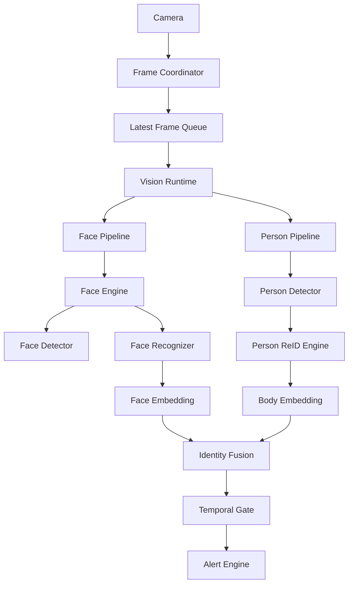
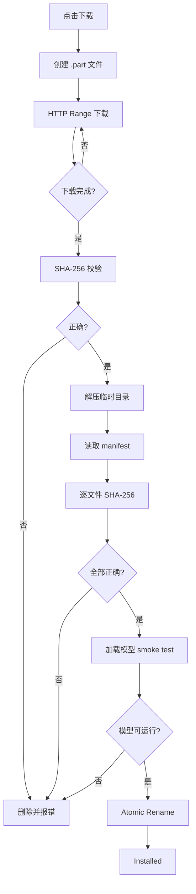
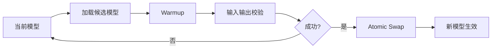
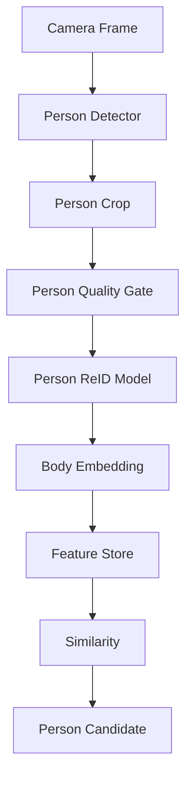
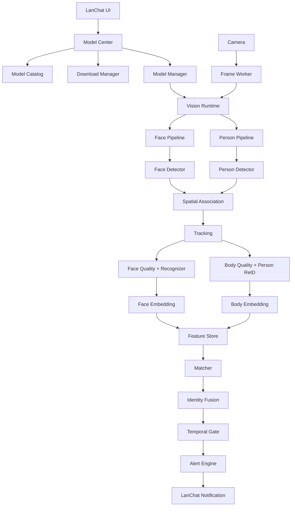

# LanChat 本地视觉识别系统重构与模型可插拔架构设计方案

> 适用项目：`DumKing/lanchat`
> 目标：在保持 **Rust + Tauri + 本地离线 AI + ONNX Runtime** 主体架构不变的前提下，将现有摄像头人脸识别能力重构为可扩展的本地视觉识别平台，支持人脸识别、人体 ReID、模型下载、安装、校验、切换、热加载、特征版本隔离及后续步态识别扩展。

---

# 0. 方案状态、范围与已确认决策

## 0.1 文档状态

本文档是 LanChat `v0.5.1` 之后视觉识别系统重构的实施依据。文档中带有“未来”“建议”“可选”字样的早期设想，如果与本章冲突，以本章和后续标记为“确认版”的章节为准。

本次目标不是推倒现有识别功能，而是在保持聊天、桌宠、告警、摄像头通话和远程超管能力可用的前提下，将现有单体实现演进为可测试、可回滚、可扩展的本地视觉识别平台。

## 0.2 当前实现基线

以 `v0.5.1` 代码为准，现有实现并非只有人脸识别，已经具备以下能力：

- `src-tauri/src/face_monitor.rs` 同时持有人脸检测、人脸识别、人体检测、人体 ReID、阈值和连续命中状态。
- 人脸模板仍使用固定 `[f32; 128]`，人体模板已经使用动态 `Vec<f32>`。
- `FaceModelManifest` 已接受 schema 1 至 3，但当前 V3 仍是固定文件名和 SHA-256 的紧凑描述，不是通用模型描述协议。
- `submit_face_monitor_frame` 仍在 Tauri command 调用链中同步加载模板、补算缺失特征、执行推理和触发告警。
- 前端仍通过 `Array.from(sample.bytes)` 将采样帧转换成 `number[]`，存在序列化和内存复制成本。
- `AtomicBool busy` 能丢弃并发帧，但尚未形成独立 Worker、最新帧槽和结果通道。
- 当前检测输入仍有直接缩放到固定尺寸的路径，需统一改为 Letterbox 和坐标反变换。
- SQLite 已具备人员、多照片、告警、反馈、远程策略及模型版本字段，迁移时必须兼容现有数据，不能重新建库要求用户重录。
- 摄像头协调器已被聊天通话和识别共同使用，本次继续复用，不改为 Rust 独占摄像头。

## 0.3 已确认产品边界

### 平台范围

- Windows 完整实现并作为主要验收平台。
- macOS 同步完成目录、数据库、Manifest、界面和运行时抽象兼容；具体模型只有通过本机 Benchmark 后才允许启用。
- 本轮仅实现 CPU 推理。`Auto`、`DirectML`、`CoreML`、`OpenVINO` 等后端值可进入协议，但不得伪装成已经可用。

### 模型来源

采用混合来源：

1. 安装包内置低资源基线模型，保证离线可用。
2. 远程签名 Catalog 提供平衡档和实验档。
3. 模型文件优先使用 GitHub Releases，并支持 Catalog 镜像地址。
4. 下载时动态读取系统代理，也允许用户配置代理、直连和 GitHub Token。
5. 高级模式允许导入本地 ZIP，但只能标记为“本地未签名”，不能被超管远程强制分发。

官方 Catalog 只能发布许可证明确允许再分发的模型。研究用途或许可证不明确的模型只提供适配器和导入说明，不进入官方模型资产。

### 模型档位

- 正式档位只有“低资源”和“平衡”。
- “高精度”作为实验档展示，不承诺所有普通笔记本可用。
- 普通用户选择预设档位；高级模式可以组合兼容的检测器和识别器。
- 兼容组合由 Manifest 和内置 Adapter Registry 决定，不允许任意拼装输入输出不兼容的模型。
- 安装包只携带低资源基线；平衡档与实验档按需下载。

### 普通笔记本约束

- 平衡档整套模型建议不超过 350MB。
- 单个模型压缩包默认不得超过 512MB，解压后不得超过 1.5GB。
- 实验档整套资源尽量控制在 800MB 内。
- 模型缓存默认上限 2GB，允许调整；内置基线、当前模型和上一套可回滚模型不参与自动清理。

## 0.4 已确认运行时规则

### 摄像头与通话

- WebView `CameraMediaCoordinator` 继续拥有摄像头采集流。
- 通话使用原始媒体轨道，识别使用降采样副本。
- 关闭视频通话画面只停止向对方发送视频轨道，不能关闭仍被识别任务使用的本地摄像头。
- 识别服务提升为应用级生命周期，离开设置页、关闭预览或最小化到托盘都不得停止。
- 侧边栏和托盘菜单显示识别状态，并提供“暂停识别/恢复识别”。暂停只停止采样，不修改持久化任务配置。

### 推理 Worker

- 使用 Rust 后台专用线程，不使用独立子进程。
- Worker 独占模型 Session、跟踪器、FeatureStore 快照和短期状态。
- 输入为容量 1 的 `LatestFrameMailbox`。新帧覆盖尚未处理的旧帧，禁止排队追帧。
- 前端通过 Raw IPC 发送降采样帧，禁止继续使用 `Array.from(Uint8Array)`。
- 图像只解码一次。统一在共享 RGB/RGBA Frame 上完成检测、裁剪、质量分析和特征提取。
- 主界面优先启动，模型在后台加载、校验和 Warmup，不得阻塞聊天、桌宠和托盘。

### 资源调度

- 实时识别优先于 Benchmark 和 Embedding 重算。
- Benchmark、模型 Smoke Test 和 Embedding 重算进入低优先级、可暂停、可续算任务队列。
- 视频通话或系统繁忙时降低识别频率，并暂停后台重算。
- 性能不足时只降低采样 FPS、输入分辨率、人体检测频次和远景分块频次，不自动更换特征模型。
- 负载恢复后采用迟滞策略逐级恢复，禁止在高低配置间频繁跳变。

主要验收基线：

```text
设备：普通办公笔记本 CPU
输入：720p 摄像头
平衡档采样：3 FPS
单帧端到端处理：P95 <= 300ms
待处理帧：最多 1 帧
识别模块新增常驻内存：目标 <= 300MB
```

## 0.5 已确认识别与告警规则

### 参考照片

- 每个人至少 3 张才能正式启用，建议 6 至 12 张，最多 30 张。
- 一张照片检测到多个候选人员时拒绝录入，要求用户裁剪或重新选择。
- 严重模糊、目标过小、无法检测等照片直接拒绝。
- 轻度侧脸、遮挡、远景允许用户确认保留，但必须记录质量分并降低权重。
- 系统自动判断照片可用于 `face`、`body` 或两者，用户可按照片禁用某一模态。
- 人体样本分为长期外观和临时穿着。临时穿着默认 24 小时后降权、7 天后失效；人脸样本不使用该失效规则。

### 多样本聚合

禁止只取多张照片中的最高相似度。每种模态采用：

```text
质量加权原型中心
    +
Top-K 有效样本一致性
    +
Top1 / Top2 人员差距
```

离群样本自动降权或排除。必须同时保存原始相似度、质量分、第二候选和差距，UI 对归一化后的结果统一称为“匹配分”，不得宣称为统计概率。

### 证据等级

```rust
pub enum IdentityDecision {
    ConfirmedFace,
    ConfirmedFusion,
    ProbableBody,
    Unknown,
}
```

- 强人脸证据产生 `ConfirmedFace`。
- 人脸和人体在同一 Track 上共同满足规则时产生 `ConfirmedFusion`。
- 无可用人脸时，人体必须同时满足高阈值、Top1/Top2 Margin、质量门禁和多帧一致性，才产生 `ProbableBody`。
- `ProbableBody` 可以发送告警，但必须明确标识为“人体疑似”，不能伪装成人脸确认。
- 更低可信的人体候选仅进入本地诊断记录，不对外推送。

### 事件合并与冷却

- 同一 Track 先产生人体疑似、随后被人脸确认时，升级原告警的证据等级和详情，不再发送第二条独立告警。
- 人脸和人体冷却时间分别配置、分别计时。
- 短时间同轨迹事件仍需合并。冷却期间更新最后出现时间和证据，不重复推送。
- 陌生人员告警按摄像头任务独立配置，默认关闭；开启后也必须通过质量、连续帧和独立冷却门禁。
- 告警截图只在真正生成告警时保存，本地默认保留 7 天并受缓存容量/LRU 约束；候选帧和普通采样帧只存在内存。
- 局域网和外部机器人默认只发送文字与识别元数据，不发送截图和 Embedding。

## 0.6 已确认模型生命周期

模型启用流程：

```text
下载或导入
  -> 隔离目录解压
  -> 结构、尺寸、哈希、签名校验
  -> Manifest 兼容性检查
  -> 推理 Smoke Test
  -> 本机 Benchmark
  -> 创建新 EmbeddingSpace
  -> 后台可恢复重算
  -> 新模型 Warmup
  -> 原子切换 Runtime + FeatureStore
  -> 保留上一套 LastKnownGood
```

安全、兼容和 Smoke Test 失败时绝对禁止启用。性能或本地准确率低于推荐线时显示醒目警告，用户确认后仍可启用。超管可以强制启用实验档，但仍不能绕过上述安全底线。

运行时失败策略：

1. 单帧失败只丢弃当前帧并记录阶段错误。
2. 连续 3 次推理失败后重建 Session。
3. 重建仍失败时回滚到 `LastKnownGood`。
4. 没有上一版本时回退到内置基线。
5. 失败模型隔离 10 分钟，禁止立刻自动重试形成循环。

回滚后，新模型已生成的特征保留但标记为暂停使用，后续重新测试时支持增量续算。

## 0.7 已确认模型信任边界

- 官方 Catalog 和官方模型包必须经过数字签名。
- 软件内置根公钥；Catalog 可以携带由根密钥签名的发布公钥和吊销列表，实现密钥轮换。
- 离线时只使用签名有效且未过期的 Catalog 缓存。
- 模型包只能包含模型、Manifest、标签和静态元数据，不得执行脚本、DLL 或任意原生代码。
- 预处理和后处理只能通过软件内置 Adapter ID 选择。
- 本地未签名模型必须醒目标识，只允许本机高级模式安装。
- 本地未签名模型入口默认关闭，用户在高级模式单独启用并逐次确认风险后才可安装。ONNX 本身仍是不可信二进制数据，同进程 ONNX Runtime 不能提供完整安全隔离。
- 未签名模型在创建 Session 前必须解析图结构，拒绝外部数据引用、未知/自定义算子、无限动态维度、超出支持范围的 Opset、异常节点数量和预计 Tensor 内存超限。
- Worker 为推理设置软超时并停止接收新帧；由于同进程线程无法安全强杀，单次推理长期卡死时将 Runtime 标记为 Failed、停止监控并提示重启软件。该残余风险是选择线程 Worker 和本地未签名模型的已知边界。
- 远程超管身份验证本轮沿用现有局域网超管标识，不增加公钥配对。该机制存在发送者可伪造风险，必须登记为已接受的安全债务。
- 模型版本、硬件和运行状态不进入普通设备在线广播；仅在超管查询或策略执行时返回必要摘要。

## 0.8 已确认数据与隐私规则

- 参考照片保存在应用私有目录，本轮不增加磁盘加密。
- 人脸、人体及后续模态的 Embedding 只保存在本机，禁止通过局域网或外部推送传输。
- 超管下发人员配置时只发送原始参考照片和配置，目标设备本地完成质量门禁和特征提取。
- 删除人员时立即删除其参考照片和全部 EmbeddingSpace 特征；历史告警保留删除时名称快照，并标记“人员已删除”。
- 人员库支持密码加密导出；导出包包含照片和配置，不包含特征，导入后重新提取。
- Debug 日志允许记录模型版本、阶段耗时、检测数量、质量、原始分数、阈值决策、Track ID 和错误码；禁止记录 Base64 图片、完整 Embedding 和敏感绝对路径。
- 模型 Benchmark 和准确率测试默认只保存在本机。超管只接收“适合/勉强/不推荐/失败”等状态摘要。

## 0.9 本地准确率验收

- 录入照片只用于建库，不能同时作为准确率测试集。
- 用户可以建立本机私有 Golden Set，包含不同距离、角度、遮挡、光照、穿着和无关人员负样本。
- 评估结果按模型、EmbeddingSpace、人员和识别模态统计召回、误报、混淆和耗时。
- “真实/虚假”反馈用于统计和生成阈值调整建议，但不得在后台静默改变阈值。
- 阈值按模型/EmbeddingSpace 独立保存；首次使用 Manifest 推荐值，后续恢复该模型上次配置。
- 超管可以下发并锁定当前模型阈值。切换模型时不能把旧模型阈值原样套用到新模型。

## 0.10 推荐实施方法

采用渐进式模块化重构，不采用一次性替换：

1. 先建立兼容门面、Worker 和观测指标，保持现有模型行为。
2. 再迁移动态 Embedding、FeatureStore、质量门禁和 Tracking。
3. 完成 Identity Fusion、告警事件合并和独立冷却。
4. 最后开放模型中心、签名 Catalog、下载、Benchmark、原子切换和超管策略。

每个阶段都必须具备旧数据兼容、独立测试、性能对比和回滚开关。任何阶段都不能以牺牲聊天、桌宠、通话或告警即时性为代价。

---

## 1. 背景与现状

> 第 1 至 77 章保留原始分析、候选技术和演进理由，属于“背景与候选分析”。其中的示例接口、模型名称、命令名、事件名和参数不构成最终契约。第 0 章及第 78 至 85 章属于“确认版规范”，实施时只允许使用确认版契约。文中已确认的 Windows 完整落地、macOS 架构兼容是本轮最新范围决定。

当前 LanChat 已经具备第一版本地摄像头人脸识别能力，核心技术链路为：

```text
WebView Camera
    ↓
cameraMediaCoordinator.ts
    ↓ JPEG Sample
Tauri IPC
    ↓
FaceMonitorRuntime
    ↓
YuNet
    ↓
Face Alignment
    ↓
SFace
    ↓
128D Embedding
    ↓
Cosine Similarity
    ↓
连续命中 / 冷却
    ↓
告警
```

当前实现已经具备以下良好基础：

- Rust 侧使用 ONNX Runtime 推理。
- YuNet 负责人脸检测。
- SFace 负责人脸特征提取。
- 模型通过 `manifest.json` 进行版本和 SHA-256 校验。
- 人脸特征只保存在本机。
- 摄像头帧只用于内存推理。
- 已具备人员特征缓存到 SQLite 的能力。
- 已具备 `embedding_model_version`，可以处理模型升级。
- 已具备采样 FPS、连续命中、冷却时间等基础告警策略。
- 摄像头监控与通话共用媒体轨道，避免重复占用摄像头。

当前代码主要集中在：

```text
src-tauri/src/face_monitor.rs
src-tauri/src/lib.rs
src-tauri/src/storage.rs

src/services/cameraMediaCoordinator.ts
src/services/tauri-api.ts
src/types/face-monitor.ts

src-tauri/resources/object-models/
```

现阶段架构适合作为 MVP，但如果继续增加：

```text
InsightFace
Open Model Zoo
ArcFace
SCRFD
OSNet
FastReID
人体属性
步态识别
多模型下载
模型切换
GPU Backend
```

如果不先抽象架构，后续很容易演变为：

```rust
if model == "sface" {
    ...
} else if model == "arcface" {
    ...
} else if model == "osnet" {
    ...
}
```

最终导致视觉代码、业务代码和模型逻辑严重耦合。

---

# 2. 重构目标

## 2.1 核心目标

本次重构最终需要达到：

```text
业务层不关心：

YuNet
SFace
SCRFD
ArcFace
OSNet
Open Model Zoo
InsightFace
embedding 维度
RGB / BGR
模型输入尺寸
模型输出名称
```

业务层只关心：

```text
检测到了谁
匹配分数是多少
是否满足告警条件
```

模型层则负责：

```text
模型下载
模型校验
模型加载
图像预处理
ONNX 推理
模型后处理
Embedding
相似度规则
模型切换
```

---

## 2.2 最终能力目标

### 人脸识别

支持：

```text
OpenCV Zoo
├── YuNet
└── SFace

InsightFace
├── SCRFD
└── ArcFace

Open Model Zoo
├── Face Detector
├── Landmark
└── ArcFace / Face ReID

自定义
└── ONNX Pipeline
```

### 人体特征识别

支持：

```text
Torchreid
├── OSNet x0.25
├── OSNet x0.5
├── OSNet x1.0
└── OSNet-AIN x1.0

Open Model Zoo
├── person-reidentification-retail-0288
├── 0287
├── 0286
└── 0277

FastReID
├── BoT
├── AGW
└── SBS
```

### 后续可扩展

```text
人体属性识别
步态识别
目标追踪
多摄像头 ReID
GPU 推理
DirectML
OpenVINO
TensorRT
```

---

# 3. 总体架构

建议将当前 `FaceMonitorRuntime` 升级为统一的：

```text
VisionRuntime
```

整体结构：



核心原则：

```text
Camera
    ↓
VisionRuntime
    ↓
可插拔 Pipeline
    ↓
统一 RecognitionResult
    ↓
告警业务
```

---

# 4. 分层设计

建议拆分为 6 层：

```text
┌─────────────────────────────────┐
│            业务层               │
│  Alert / Policy / Lan / UI      │
├─────────────────────────────────┤
│          Identity Layer         │
│ Matching / Fusion / Tracking    │
├─────────────────────────────────┤
│          Vision Pipeline        │
│ Face / Person / Gait            │
├─────────────────────────────────┤
│          Model Adapter          │
│ SFace / ArcFace / OSNet         │
├─────────────────────────────────┤
│       Inference Backend         │
│ ONNX Runtime / OpenVINO         │
├─────────────────────────────────┤
│        Model Management         │
│ Catalog / Download / Install    │
└─────────────────────────────────┘
```

---

# 5. Rust 目录重构

建议最终结构：

```text
src-tauri/src/
│
├── vision/
│   │
│   ├── mod.rs
│   ├── runtime.rs
│   ├── worker.rs
│   ├── frame.rs
│   ├── error.rs
│   ├── metrics.rs
│   │
│   ├── embedding/
│   │   ├── mod.rs
│   │   ├── vector.rs
│   │   ├── similarity.rs
│   │   └── space.rs
│   │
│   ├── preprocessing/
│   │   ├── mod.rs
│   │   ├── image.rs
│   │   ├── normalize.rs
│   │   └── letterbox.rs
│   │
│   ├── inference/
│   │   ├── mod.rs
│   │   ├── backend.rs
│   │   └── ort.rs
│   │
│   ├── face/
│   │   │
│   │   ├── mod.rs
│   │   ├── engine.rs
│   │   ├── types.rs
│   │   ├── alignment.rs
│   │   ├── quality.rs
│   │   │
│   │   └── providers/
│   │       ├── opencv/
│   │       │   ├── yunet.rs
│   │       │   └── sface.rs
│   │       │
│   │       ├── insightface/
│   │       │   ├── scrfd.rs
│   │       │   └── arcface.rs
│   │       │
│   │       └── omz/
│   │           ├── detector.rs
│   │           ├── landmark.rs
│   │           └── arcface.rs
│   │
│   ├── person/
│   │   │
│   │   ├── mod.rs
│   │   ├── engine.rs
│   │   ├── detector.rs
│   │   ├── quality.rs
│   │   │
│   │   └── providers/
│   │       ├── osnet.rs
│   │       ├── omz.rs
│   │       └── fastreid.rs
│   │
│   ├── tracking/
│   │   ├── mod.rs
│   │   ├── tracker.rs
│   │   └── track_state.rs
│   │
│   └── identity/
│       ├── mod.rs
│       ├── matcher.rs
│       ├── fusion.rs
│       └── temporal_gate.rs
│
├── models/
│   ├── mod.rs
│   ├── manifest.rs
│   ├── catalog.rs
│   ├── downloader.rs
│   ├── installer.rs
│   ├── verifier.rs
│   ├── registry.rs
│   ├── manager.rs
│   ├── switching.rs
│   └── storage.rs
│
├── camera_monitor.rs
│
├── storage.rs
├── network.rs
├── lib.rs
└── ...
```

---

# 6. 统一 Embedding 设计

当前实现中：

```rust
[f32; 128]
```

属于 SFace 专属实现。

必须改为动态维度。

建议：

```rust
#[derive(Debug, Clone)]
pub struct Embedding {
    pub space: EmbeddingSpaceId,
    pub values: Vec<f32>,
}
```

其中：

```rust
#[derive(Debug, Clone, Hash, PartialEq, Eq)]
pub struct EmbeddingSpaceId {
    pub modality: VisionModality,
    pub provider: String,
    pub model_id: String,
    pub model_version: String,
    pub adapter_id: String,
    pub semantic_fingerprint: String,
}
```

例如：

```text
OpenCV / SFace / 2026.08-rgb1
InsightFace / w600k_r50 / buffalo-l-v1
OMZ / arcface-r100 / 2026.1
Torchreid / osnet-x1 / v1
```

---

## 6.1 禁止跨模型比较

即使两个模型都是：

```text
512D
```

也不能直接比较。

例如：

```text
InsightFace ArcFace R50
        VS
OMZ ArcFace R100
```

必须禁止。

匹配前：

```rust
if probe.space != template.space {
    return Err(VisionError::EmbeddingSpaceMismatch);
}
```

---

# 7. FaceEngine 抽象

建议：

```rust
pub trait FaceEngine: Send + Sync {
    fn descriptor(&self) -> &PipelineDescriptor;

    fn detect(
        &self,
        image: &image::RgbImage,
    ) -> Result<Vec<FaceDetection>, VisionError>;

    fn extract(
        &self,
        image: &image::RgbImage,
        face: &FaceDetection,
    ) -> Result<Embedding, VisionError>;

    fn warmup(&self) -> Result<(), VisionError>;
}
```

业务层只使用：

```rust
let faces = engine.detect(&frame)?;
let embedding = engine.extract(&frame, face)?;
```

而不用知道：

```text
YuNet
SCRFD
ArcFace
SFace
```

---

# 8. PersonReIdEngine 抽象

人体识别：

```rust
pub trait PersonReIdEngine: Send + Sync {
    fn descriptor(&self) -> &PipelineDescriptor;

    fn extract(
        &self,
        image: &image::RgbImage,
        region: &PersonRegion,
    ) -> Result<Embedding, VisionError>;

    fn warmup(&self) -> Result<(), VisionError>;
}
```

第一版建议支持：

```text
OSNet x0.25
OSNet x0.5
OSNet x1.0
OSNet-AIN x1.0

OMZ 0288
OMZ 0277
```

---

# 9. 不建议每个模型都写一个 Engine

例如不要：

```text
OsNet025Engine
OsNet05Engine
OsNet1Engine
OsNetAINEngine
```

更推荐：

```text
GenericOnnxReIdEngine
        +
ModelDescriptor
```

即：

```rust
let engine = OnnxPersonReIdEngine::load(
    manifest
)?;
```

模型差异由 Manifest 描述。

---

# 10. 模型 Manifest V3

当前 Manifest 可以升级为：

> 以下 InsightFace 内容仅用于说明 Manifest 的表达能力。其示例许可证是 `non-commercial-research`，因此不能进入 LanChat 官方 Catalog 或安装包，只能作为用户自行取得权重后的本地导入示例。

```json
{
  "schemaVersion": 3,

  "id": "insightface-buffalo-l",
  "name": "InsightFace Buffalo L",
  "provider": "insightface",
  "version": "1.0.0",

  "category": "face-pipeline",

  "backend": "onnxruntime",

  "license": {
    "name": "InsightFace Model License",
    "usage": "non-commercial-research",
    "url": "https://github.com/deepinsight/insightface"
  },

  "components": {
    "detector": {
      "type": "scrfd",
      "file": "det_10g.onnx",
      "sha256": "...",

      "input": {
        "width": 640,
        "height": 640,
        "layout": "NCHW",
        "channelOrder": "RGB",

        "resizeMode": "letterbox",

        "normalization": {
          "scale": 1.0,
          "mean": [127.5, 127.5, 127.5],
          "std": [128.0, 128.0, 128.0]
        }
      }
    },

    "recognizer": {
      "type": "arcface",
      "file": "w600k_r50.onnx",
      "sha256": "...",

      "input": {
        "width": 112,
        "height": 112,
        "layout": "NCHW",
        "channelOrder": "RGB",

        "normalization": {
          "scale": 1.0,
          "mean": [127.5, 127.5, 127.5],
          "std": [128.0, 128.0, 128.0]
        }
      },

      "output": {
        "dimension": 512,
        "normalize": "l2"
      }
    }
  },

  "matching": {
    "metric": "cosine",
    "recommendedThreshold": 0.45,
    "top2Margin": 0.08
  }
}
```

---

# 11. Manifest 通用输入描述

建议：

```rust
pub struct TensorInputSpec {
    pub width: usize,
    pub height: usize,

    pub layout: TensorLayout,
    pub channel_order: ChannelOrder,
    pub resize_mode: ResizeMode,

    pub normalization: NormalizationSpec,
}
```

枚举：

```rust
pub enum ChannelOrder {
    Rgb,
    Bgr,
}

pub enum TensorLayout {
    Nchw,
    Nhwc,
}

pub enum ResizeMode {
    Stretch,
    Letterbox,
    KeepAspect,
}
```

这样可以统一支持：

```text
YuNet
SCRFD
SFace
ArcFace
OSNet
OMZ ReID
YOLO
```

---

# 12. 模型 Catalog

Manifest 描述：

```text
如何运行一个模型
```

Catalog 描述：

```text
有哪些模型可以下载
```

建议本地：

```text
resources/model-catalog.json
```

同时允许远程更新。

示例：

```json
{
  "schemaVersion": 1,
  "catalogVersion": "2026.08.1",

  "models": [
    {
      "id": "opencv-yunet-sface",
      "name": "OpenCV YuNet + SFace",

      "provider": "opencv",

      "category": "face-pipeline",

      "profile": "light",

      "description": "轻量级本地人脸识别方案",

      "download": {
        "type": "zip",
        "url": "...",
        "sha256": "..."
      }
    },

    {
      "id": "insightface-buffalo-l",
      "name": "InsightFace Buffalo L",

      "provider": "insightface",

      "category": "face-pipeline",

      "profile": "high-accuracy",

      "download": {
        "type": "zip",
        "url": "...",
        "sha256": "..."
      }
    },

    {
      "id": "osnet-x025",
      "name": "OSNet x0.25",

      "provider": "torchreid",

      "category": "person-reid",

      "profile": "ultralight",

      "download": {
        "type": "zip",
        "url": "...",
        "sha256": "..."
      }
    }
  ]
}
```

---

# 13. ModelManager

建议核心 API：

```rust
pub struct ModelManager {
    catalog: ModelCatalog,
    registry: ModelRegistry,
    installer: ModelInstaller,
}
```

提供：

```rust
list_available_models()

list_installed_models()

download_model()

pause_download()

resume_download()

cancel_download()

install_model()

verify_model()

delete_model()

activate_model()

get_active_model()

check_model_updates()
```

---

# 14. 模型存储目录

建议：

```text
%AppData%/
└── LanChat/
    └── ai/
        │
        ├── catalog/
        │   ├── catalog.json
        │   └── catalog.sig
        │
        ├── downloads/
        │   ├── buffalo_l.zip.part
        │   └── osnet_x1.zip.part
        │
        └── models/
            │
            ├── face/
            │   ├── opencv-yunet-sface/
            │   │   └── 2026.08/
            │   │
            │   └── insightface-buffalo-l/
            │       └── 1.0/
            │
            └── person/
                ├── osnet-x025/
                │   └── 1.0/
                │
                └── omz-0288/
                    └── 1.0/
```

---

# 15. 下载与安装流程

推荐：



---

# 16. 下载安全

即使是学习软件，也建议做好基础供应链安全。

## 16.1 Catalog 签名

```text
catalog.json
catalog.sig
```

程序内置：

```text
Ed25519 Public Key
```

验证：

```text
Catalog Signature
      ↓
Model Download URL
      ↓
Package SHA256
      ↓
Manifest
      ↓
Individual Model SHA256
```

---

# 17. 模型切换机制

不能直接：

```text
drop 旧模型
→ load 新模型
```

推荐：



Runtime：

```rust
pub struct VisionRuntime {
    active_profile:
        Arc<ArcSwap<ActiveVisionProfile>>,
}
```

每帧：

```rust
let profile = runtime.active_profile();
```

拿到：

```text
Arc<ActiveVisionProfile>
```

Profile 将人脸检测、人脸识别、人体检测、人体 ReID、阈值和对应 FeatureStore 快照作为一个整体原子切换。旧帧继续使用旧 Profile，新帧自动使用新 Profile。

---

# 18. 模型切换与 Embedding

切换：

```text
SFace
   ↓
ArcFace
```

不能继续使用 SFace embedding。

推荐数据库缓存多个 Embedding Space。

---

# 19. 数据库重构

## 19.1 人员主表

```sql
CREATE TABLE face_people (
    person_id TEXT PRIMARY KEY,
    display_name TEXT NOT NULL,

    enabled INTEGER NOT NULL DEFAULT 1,

    expires_at INTEGER,

    created_at INTEGER NOT NULL,
    updated_at INTEGER NOT NULL,
    deleted_at INTEGER
);
```

---

## 19.2 参考照片

建议支持多照片。

```sql
CREATE TABLE person_reference_images (
    id TEXT PRIMARY KEY,

    person_id TEXT NOT NULL,

    file_path TEXT NOT NULL,
    sha256 TEXT NOT NULL,

    quality_score REAL,
    face_quality_score REAL,
    body_quality_score REAL,

    face_usage_enabled INTEGER NOT NULL DEFAULT 1,
    body_usage_enabled INTEGER NOT NULL DEFAULT 1,

    body_sample_kind TEXT,
    body_weight REAL NOT NULL DEFAULT 1.0,
    body_weight_decay_at INTEGER,
    body_expires_at INTEGER,

    detected_subject_count INTEGER NOT NULL DEFAULT 1,
    source_width INTEGER,
    source_height INTEGER,

    created_at INTEGER NOT NULL
);
```

确认规则：

```text
至少 3 张
建议 6 ~ 12 张
最多 30 张
```

例如：

```text
正脸
轻微左侧
轻微右侧
远景
常见穿着
```

检测到多人时禁止录入。照片用途由系统自动判断，用户可以分别关闭该照片对人脸或人体特征的贡献。人体临时穿着样本默认 24 小时后降权、7 天后失效。

---

## 19.3 特征表

```sql
CREATE TABLE person_embeddings (
    id TEXT PRIMARY KEY,

    person_id TEXT NOT NULL,

    source_image_id TEXT,

    modality TEXT NOT NULL,

    embedding_space_id TEXT NOT NULL,
    provider TEXT NOT NULL,
    model_id TEXT NOT NULL,
    model_version TEXT NOT NULL,
    adapter_id TEXT NOT NULL,

    dimension INTEGER NOT NULL,

    embedding BLOB NOT NULL,

    quality REAL,
    sample_weight REAL NOT NULL DEFAULT 1.0,
    build_state TEXT NOT NULL DEFAULT 'ready',
    build_error TEXT,

    created_at INTEGER NOT NULL
);
```

其中：

```text
modality:

face
body
gait
```

---

## 19.4 索引

```sql
CREATE INDEX idx_person_embeddings_lookup
ON person_embeddings(
    embedding_space_id,
    modality,
    provider,
    model_id,
    model_version,
    person_id
);
```

---

# 20. 特征缓存

摄像头运行时不要每帧读取 SQLite。

建议：

```rust
pub struct FeatureStore {
    face_templates:
        Arc<RwLock<HashMap<EmbeddingSpaceId, Arc<Vec<PersonTemplate>>>>>,

    body_templates:
        Arc<RwLock<HashMap<EmbeddingSpaceId, Arc<Vec<PersonTemplate>>>>>,
}
```

只有以下事件刷新：

```text
人员新增
人员删除
人员禁用
照片变化
模型切换
模型升级
远端策略同步
Embedding 重算
```

---

# 21. 摄像头采集优化

当前路径：

```text
Camera
 ↓
320px
 ↓
JPEG 0.72
 ↓
Rust
 ↓
放大 640
```

建议改为：

```text
Camera
 ↓
VideoFrame
 ↓
按运行档位缩放为 640px / 720px
 ↓
RGBA8 Raw IPC
 ↓
Rust VisionWorker
```

普通监控：

```text
640 longest side
```

视频通话期间：

```text
320 / 480
```

摄像头协调器使用引用计数 Lease：

| Lease | 获得条件 | 释放条件 | 影响 |
| --- | --- | --- | --- |
| `monitor` | 识别配置启用 | 用户关闭识别或退出程序 | 保证检测所需本地轨道 |
| `preview` | 设置页/检测窗请求预览 | 页面离开或检测窗关闭 | 只影响预览订阅，不影响 monitor |
| `call` | 语音/视频通话请求媒体 | 通话结束 | 复用本地轨道并管理发送轨道 |

只有所有 Lease 都释放时才允许真正停止摄像头轨道。通话中关闭视频只禁用或移除对外发送 Track，不得停止 `monitor` Lease 持有的本地 Track。

采样优先使用 `HTMLVideoElement.requestVideoFrameCallback`，不再仅依赖 `setInterval`。Rust 侧 Watchdog 比较目标 FPS 与最近实际接收时间：连续 10 秒低于目标的 50% 时进入 `sampling=Starved`，尝试一次媒体流重建并通知界面；恢复 10 秒后退出 Starved。

WebView 后台节流是本轮保留 WebView 采集的已知风险。Windows 托盘状态必须实测满足目标采样率；如果无法满足，则该验收项阻断发布，并重新评估原生采集宿主，不能在文档层面宣称已经保证持续监控。

---

# 22. 图像不要强行拉伸为 640×640

建议：

```text
16:9
640×360
```

使用：

```text
Letterbox
```

变成：

```text
640×640
```

而不是 Stretch。

记录：

```rust
pub struct LetterboxMeta {
    pub scale: f32,
    pub pad_x: f32,
    pub pad_y: f32,
}
```

坐标还原：

```text
x = (model_x - pad_x) / scale
y = (model_y - pad_y) / scale
```

---

# 23. 图像转换只执行一次

Raw IPC 后 Rust 直接获得共享 RGBA/RGB Frame，不再为每个模型重复 JPEG Decode 或颜色转换：

```rust
fn recognize_frame(frame: VisionFrame) {
    let image = frame.into_shared_rgb()?;

    let detections =
        detector.detect(&image)?;

    for detection in detections {
        recognizer.extract(
            &image,
            &detection,
        )?;
    }
}
```

避免：

```text
每个 Pipeline 各自复制 RGBA
每个检测框重复颜色转换
为 Detector 和 Recognizer 重复解码/转换
```

Detector、Recognizer、Quality Gate 和截图裁剪只借用同一个共享 RGB Frame。

---

# 24. Tauri IPC 优化

避免：

```ts
Array.from(sample.bytes)
```

造成：

```text
Uint8Array
    ↓
number[]
    ↓
JSON / serde
```

建议 Tauri Raw IPC：

```text
ArrayBuffer
      ↓
InvokeBody::Raw
```

或者后续将摄像头采样也迁到 Rust。

---

# 25. AI Worker

推理不要直接跑在普通 Tokio async worker 中。

建议独立 AI Worker。

```text
Camera
   ↓
LatestFrameSlot
   ↓
AI Thread
   ↓
VisionRuntime
   ↓
Result Channel
   ↓
Tauri Event
```

---

## 25.1 Latest Frame Wins

摄像头识别不是视频编码，不需要逐帧处理。

如果：

```text
Frame 1 处理中

Frame 2
Frame 3
Frame 4
```

应该：

```text
1 → 4
```

而不是：

```text
1 → 2 → 3 → 4
```

队列建议：

```text
capacity = 1
```

或者：

```text
Atomic Latest Frame
```

---

# 26. Face Quality Gate

进入识别前增加质量控制。

判断：

```text
人脸尺寸
模糊度
曝光
关键点可信度
侧脸角度
遮挡
是否超出边界
```

例如：

```text
face_width < 48px
→ 不识别
```

否则：

```text
20×20
 ↓
Resize 112
 ↓
SFace / ArcFace
```

容易产生错误 embedding。

---

# 27. 人体 Quality Gate

Person ReID 也应该做：

```text
BBox 过小
人体截断
只有上半身
严重遮挡
过暗
运动模糊
```

人体 ReID 建议只有满足：

```text
人物高度 > 120px
可见比例 > 70%
```

才提取 embedding。

具体阈值需通过实际摄像头数据校准。

---

# 28. 真正的 Consecutive Hits

当前连续命中概念建议重构。

状态：

```rust
pub struct HitGateState {
    pub consecutive_hits: u8,

    pub last_hit_at: i64,

    pub last_frame_id: u64,

    pub last_alert_at: i64,
}
```

只有：

```text
当前帧
      ↓
上一帧或允许跳过极少量帧
```

才累计。

如果：

```text
miss
```

则：

```text
hits = 0
```

---

# 29. Top1 / Top2 Margin

不能只看：

```text
最高 similarity
```

例如：

```text
王某 0.62
李某 0.61
```

不应该直接认为是王某。

推荐：

```text
Top1 >= Threshold

AND

Top1 - Top2 >= Margin
```

例如：

```text
Top1 = 0.68
Top2 = 0.40

Margin = 0.28
```

可信度明显更高。

---

# 30. 不要把 cosine similarity 直接称为百分比置信度

例如：

```text
similarity = 0.62
```

不等于：

```text
62% 概率
```

内部建议：

```rust
pub struct MatchScore {
    pub similarity: f32,
    pub second_best: Option<f32>,
    pub margin: Option<f32>,
}
```

UI：

```text
匹配分：74
```

而不是：

```text
置信度：62%
```

原始相似度只在高级诊断中展示。Manifest 为每个 EmbeddingSpace 定义分数归一化映射，用于形成 0 至 100 的“匹配分”和桌宠温度；该映射仍然不是统计概率。后续有独立标注集时可以增加校准器，但不能改变原始分数的保存方式。

---

# 31. 人体 ReID 架构

人体识别流程：



---

# 32. 首批人体模型建议

本节只列候选模型家族，不代表全部进入官方 Catalog。首批正式 Profile 只选择通过许可证、体积、普通笔记本性能和准确率验收的组合。

建议第一批只支持：

```text
Torchreid

OSNet x0.25
OSNet x0.5
OSNet x1.0
OSNet-AIN x1.0


Open Model Zoo

Person ReID 0288
Person ReID 0277
```

UI：

```text
人体识别模型

○ 极速
  OSNet x0.25

● 均衡
  OSNet x0.5

○ 高精度
  OSNet x1.0

○ 跨环境
  OSNet-AIN x1.0

○ Intel 极轻量
  OMZ 0288

○ Intel 高精度
  OMZ 0277
```

---

# 33. 人脸模型建议

本节同样是 Adapter 候选范围。许可证禁止再分发或来源不明确的权重只能由用户本地导入，不得随安装包或官方 Catalog 发布。

首批：

```text
OpenCV Zoo
YuNet + SFace

InsightFace
Buffalo SC
Buffalo S
Buffalo L

Open Model Zoo
ArcFace R100
```

---

# 34. 模型分类

Catalog 中建议定义：

```rust
pub enum ModelCategory {
    FacePipeline,
    FaceDetector,
    FaceRecognizer,

    PersonDetector,
    PersonReId,

    PersonAttribute,

    GaitRecognition,
}
```

---

# 35. Identity Fusion

最终不要把：

```text
Face
Body
```

分别直接告警。

统一进入 Identity Fusion。

```text
Face Similarity
        │
        ├─────────────┐
                      ▼
                 Identity
                      ▲
        ├─────────────┘
Body Similarity
```

---

## 35.1 建议融合策略

优先级：

```text
Face
>
Body
>
Tracking
>
Gait
```

第一版推荐规则法，不需要训练融合模型。

例如：

```text
Face >= strong threshold
→ MATCH

Face >= normal threshold
AND
Body >= body threshold
→ MATCH

Face unavailable
AND
Body >= strong body threshold
AND
连续多帧
→ PROBABLE BODY
```

---

# 36. RecognitionResult

统一输出：

```rust
pub struct RecognitionResult {
    // Worker 仅允许将当前流的结果交给告警层，避免旧摄像头流结果串入新流。
    pub stream_id: String,
    pub stream_generation: u64,
    pub frame_id: u64,

    pub track_id: String,

    pub person_id: Option<String>,

    pub face: Option<FaceMatchResult>,

    pub body: Option<PersonMatchResult>,

    pub evidence: Vec<RecognitionEvidence>,

    pub decision: IdentityDecision,
}
```

Decision：

```rust
pub enum IdentityDecision {
    ConfirmedFace,
    ConfirmedFusion,
    ProbableBody,
    Unknown,
}
```

---

# 37. Tracking

本次必须增加轻量 Tracking。

目的不是复杂视频分析，而是：

```text
避免同一个人在连续帧中重复做全量识别
```

流程：

```text
Person Detector
      ↓
Tracker
      ↓
Track ID
      ↓
第一次或定期 ReID
```

例如：

```text
Track 7
```

已经识别为：

```text
王某
```

后续 1 秒内不需要每帧重新跑 ArcFace / OSNet。

## 37.1 空间关联、冲突与事件升级

处理顺序固定为：

```text
Face/Person Detection
  -> 人脸框与人体框空间关联
  -> Tracking
  -> 按 Track 做质量门禁与 Embedding
  -> Matching
  -> Identity Fusion
  -> Temporal Gate
  -> Alert Engine
```

空间关联第一版使用确定性规则：人脸中心必须落在扩张 5% 的人体框内；命中多个人体框时选择包含人脸且面积最小的框。无法唯一关联的人脸和人体证据不能融合。

冲突规则：

- 强人脸命中 A、人体命中 B 时，以 A 作为人员候选，但记录 `body_conflict`，不能形成 `ConfirmedFusion`。
- 普通人脸命中 A、人体命中 B 时结果降为 `Unknown`，进入本地诊断，不发送人员告警。
- Detector 按调度策略跳过的帧不算 miss；实际执行检测但对应 Track 没有候选才累计 miss。
- Track 默认在最后观察后保留 2.5 秒，具体值属于 Profile 的 Temporal Gate 配置。

`AlertEngine` 在内存中维护 `track_id -> alert_id`，创建告警时同时写入 `vision_alert_events`。同一 Track 的人体疑似升级为人脸确认时递增 `revision`、更新 Evidence 并发出 `vision_alert_upgraded`，不再创建第二条告警或重复外部机器人推送。进程重启后 Track 不恢复，人员级冷却从数据库最后告警时间恢复。

---

# 38. 模型阈值必须与模型绑定

不要全局：

```text
minConfidence = 60
```

应该：

```text
Face Threshold

按模型
```

例如：

```text
opencv-sface
0.36

insightface-buffalo-l
0.45

omz-arcface
0.50
```

这里只是配置示例，最终值必须通过实际测试集校准。

数据库：

```sql
CREATE TABLE model_matching_profiles (
    embedding_space_id TEXT NOT NULL,
    modality TEXT NOT NULL,
    threshold REAL NOT NULL,
    top2_margin REAL NOT NULL,
    score_mapping_json TEXT NOT NULL,
    settings_locked INTEGER NOT NULL DEFAULT 0,
    issued_by_device_id TEXT,
    updated_at INTEGER NOT NULL,

    PRIMARY KEY(embedding_space_id, modality)
);
```

---

# 39. 模型测试页面

强烈建议增加：

```text
模型实验室
```

显示：

```text
当前 Face Pipeline

InsightFace Buffalo L

Detector:
SCRFD

Recognizer:
ArcFace R50

Embedding:
512D

Backend:
ONNX Runtime
```

实时：

```text
检测耗时
识别耗时
总耗时
FPS

人脸检测分数

Top1
Top2
Margin

Face Similarity
Body Similarity

最终 Identity Decision
```

---

# 40. 模型性能指标

建议 runtime 维护：

```rust
pub struct VisionMetrics {
    pub frames_received: u64,

    pub frames_processed: u64,

    pub frames_dropped: u64,

    pub avg_decode_ms: f32,

    pub avg_detect_ms: f32,

    pub avg_face_recognition_ms: f32,

    pub avg_body_reid_ms: f32,

    pub avg_total_ms: f32,
}
```

设置页面可显示：

```text
AI 性能

采样：2 FPS

平均处理：
42 ms

Face Detection：
16 ms

Face Recognition：
12 ms

Person ReID：
10 ms

Dropped：
3
```

---

# 41. CPU / GPU Backend

第一阶段：

```text
ONNX Runtime CPU
```

后续再增加：

```text
CUDA
DirectML
OpenVINO
TensorRT
```

建议现在就抽象：

```rust
pub trait InferenceBackend:
    Send + Sync
{
    fn load(
        &self,
        path: &Path,
        config: &SessionConfig,
    ) -> Result<
        Box<dyn ModelSession>,
        VisionError
    >;
}
```

第一版：

```text
OrtBackend
```

---

# 42. Session 配置

建议 Manifest 或本地设置支持：

```text
threads
execution provider
graph optimization
memory arena
```

例如：

```rust
pub struct SessionConfig {
    pub intra_threads: usize,

    pub inter_threads: usize,

    pub provider: ExecutionProvider,
}
```

默认：

```text
CPU
```

`Auto`、`DirectML`、`CoreML` 和 `OpenVINO` 可以作为保留枚举值，但本轮 UI 不得把未实现 Backend 显示为可选。

---

# 43. 模型加载时 Warmup

首次推理通常更慢。

切换模型：

```text
load
 ↓
warmup
 ↓
verify
 ↓
activate
```

Warmup：

```text
Face Detector:
640×640 zero tensor

Face Recognizer:
112×112 zero tensor

OSNet:
256×128 zero tensor
```

---

# 44. 模型失败回滚

例如：

```text
用户切换 Buffalo L

        ↓

模型加载失败
```

必须：

```text
继续保持原模型
```

不能导致：

```text
VisionRuntime unavailable
```

所以：

```text
CandidateRuntime
       ↓
成功
       ↓
swap
```

而不是原地 reload。

---

# 45. expiresAt 必须生效

人员查询和内存模板加载必须过滤：

```text
enabled = true

AND

deleted_at IS NULL

AND

(
 expires_at IS NULL
 OR
 expires_at > now
)
```

---

# 46. 参考照片多人处理

参考照片：

```text
0 张人脸但存在单个合格人体
→ 仅作为 body 样本

要求用于人脸但检测不到人脸
→ 拒绝 face 用途

1 个明确目标
→ 自动

>1 个候选人员
→ 拒绝录入，要求裁剪或重新选择单人照片
```

不要自动选：

```text
detector score 最大的人
```

---

# 47. 多参考照片

最终建议支持：

```text
王某

├── reference 1
├── reference 2
├── reference 3
├── reference 4
└── reference 5
```

匹配：

```text
probe
  ↓
和王某所有模板比较
  ↓
质量加权原型中心
  +
Top-K 有效样本一致性
  +
Top1 / Top2 人员差距
```

禁止使用单张最高分作为最终人员匹配结果。严重离群样本必须自动降权或排除，轻度低质量样本按照片质量参与加权。

## 47.1 确认版聚合公式

对同一个 `person_id + embedding_space_id`：

1. 每个 Embedding 先做 L2 Normalize。
2. 基础质量权重 `q_i = clamp(quality_score / 100, 0.25, 1.0)`。
3. 长期样本时间权重 `d_i = 1.0`。
4. 人体临时穿着样本在 24 小时内 `d_i = 1.0`，之后线性衰减，到第 7 天变为 0。
5. 有效权重 `w_i = q_i * d_i * manual_weight`。
6. 使用样本间平均余弦最高的向量作为 Medoid，计算每个样本到 Medoid 的相似度。
7. 当 `similarity_i < max(outlier_floor, median - outlier_mad_multiplier * MAD)` 时判定为离群样本。`outlier_floor` 和 `outlier_mad_multiplier` 由 EmbeddingSpace 配置，默认 multiplier 为 2.5。
8. 原型向量 `prototype = normalize(sum(w_i * embedding_i) / sum(w_i))`。
9. Probe 与有效样本比较，取 `K = min(3, valid_sample_count)` 个最高分做加权平均 `top_k_score`。
10. 人员原始聚合分 `aggregate = 0.6 * cosine(probe, prototype) + 0.4 * top_k_score`。
11. 在所有人员 aggregate 中计算 Top1、Top2 和 Margin，最终仍需通过该 EmbeddingSpace 的 threshold、margin、质量及连续帧门禁。

新建人员少于 3 张有效照片不得正式启用；旧版迁移人员可在样本不足标记下使用 `K = valid_sample_count`。如果某模态没有任何有效样本，该模态不参与 Fusion，不能用 0 分替代。

上述 `0.6/0.4`、`K=3` 和离群参数属于 `builtin.matcher.prototype-topk.v1` 的语义版本。以后修改任何公式常量都必须升级 Matcher Adapter 和 Matching Profile 版本，并用固定向量 Golden Test 锁定结果。只有 Embedding 生成语义变化时才升级 `EmbeddingSpaceId`，单纯修改匹配公式不要求重算向量。

---

# 48. 模型升级

模型版本变化：

```text
Buffalo L v1
        ↓
Buffalo L v2
```

不能继续使用：

```text
v1 embeddings
```

但不需要删除。

数据库继续保存：

```text
v1
v2
```

当前 runtime：

```text
只加载 v2
```

回滚模型时：

```text
v1 embedding
```

仍然可用。

---

# 49. Embedding 重算任务

模型切换时不要一次阻塞 UI。

建议：

```text
Background Feature Build
```

状态：

```text
Waiting
Processing
Ready
Failed
```

例如：

```text
正在为 InsightFace Buffalo L
生成本地人员特征

17 / 23
```

---

# 50. 模型激活状态

建议：

```rust
pub enum ModelInstallState {
    NotInstalled,

    Downloading,

    Paused,

    Installed,

    Activating,

    Active,

    Invalid,

    UpdateAvailable,
}
```

---

# 51. 前端模型中心

模型中心不是设置页中的一张卡片，而是左侧主导航中的独立“视觉识别”工作区。设置页只保留摄像头任务开关、隐私、存储和高级诊断入口。

默认视图展示：

```text
当前档位与模型状态
低资源 / 平衡 / 实验档
初始化、下载、重算、切换、回滚进度
本机 Benchmark 结论
模型更新与磁盘占用
```

高级模式才展示组件、Manifest、EmbeddingSpace、原始匹配分和诊断数据。

---

## 人脸识别

```text
当前：
平衡档

● 已审计平衡档人脸 Pipeline
  平衡
  已安装
  当前使用

○ 内置低资源人脸 Pipeline
  轻量
  已安装
  [切换]

○ 实验档
  需下载
  本机测试后可启用
```

---

## 人体 ReID

```text
当前：
平衡档人体 Pipeline

○ 内置低资源人体 Pipeline
  极低资源

● 已审计平衡档人体 Pipeline
  当前使用

○ 实验档人体 Pipeline
  本机测试后可启用
```

---

# 52. 普通模式与高级模式

普通模式：

```text
AI 性能模式

○ 低资源
● 均衡
○ 实验档
```

后台映射：

```text
低资源

Face:
内置低资源人脸 Pipeline

Body:
内置低资源人体 Pipeline
```

均衡：

```text
Face:
签名 Catalog 中通过许可证审计的平衡档人脸 Pipeline

Body:
签名 Catalog 中通过许可证审计的平衡档人体 Pipeline
```

实验档：

```text
具体组件由签名 Catalog 提供，并且必须通过许可证审计、兼容性检查、Smoke Test 和本机 Benchmark。
```

---

高级模式：

```text
Face Pipeline
[ 从兼容组件中选择 ]

Body ReID
[ 从兼容组件中选择 ]

Backend
[ ONNX Runtime ]

Device
[ CPU ]

Face Threshold
[ 0.45 ]

Body Threshold
[ 0.68 ]

Top2 Margin
[ 0.08 ]
```

---

# 53. Tauri Commands

早期命令草案已废弃。最终名称、请求、响应、权限、幂等和错误契约统一见第 82 章，不得实现第二套同义命令。

---

# 54. Tauri Events

早期事件草案已废弃。最终事件信封、Payload、revision 和状态恢复规则统一见第 82 章。

---

# 55. ModelRegistry

建议：

```rust
pub struct ModelRegistry {
    installed:
        HashMap<String, InstalledModel>,

    active_profile:
        Option<ProfileRef>,

    last_known_good_profile:
        Option<ProfileRef>,
}
```

写入：

```text
SQLite vision_model_profiles
```

---

# 56. 模型下载失败恢复

下载使用：

```text
*.part
```

例如：

```text
buffalo-l.zip.part
```

启动时：

```text
读取未完成下载
```

用户可：

```text
继续
删除
```

支持 HTTP Range。

---

# 57. 模型资源不要放 Git Repository

现有 SFace 模型约几十 MB。

未来：

```text
Buffalo L
OSNet
OMZ
```

会越来越大。

建议以后：

```text
GitHub Release Assets
```

或者自定义下载源。

仓库只保留：

```text
Catalog
Manifest Template
README
```

默认轻量模型可以继续随安装包携带。

---

# 58. 默认模型

安装包只内置一套低资源基线 Profile。基线必须同时具备可用的人脸和人体识别能力，并继续复用当前已经验证的 ONNX Runtime 适配链路。

确认要求：

```text
离线可用
CPU 可运行
整套资源足够小
拥有明确的再分发许可证
安装后无需下载即可完成 Smoke Test
```

平衡档和实验档不进入安装包：

```text
签名 Catalog
    ↓
按需下载
    ↓
本机 Benchmark
    ↓
后台重算 Embedding
    ↓
原子启用
```

具体模型名称和权重不能只凭性能建议写死，进入官方 Release 前必须逐项完成来源、许可证、SHA-256、输入输出、测试数据和再分发许可审计。

---

# 59. 隐私设计

继续保持当前原则：

```text
摄像头 Frame
只在本机内存

Reference Photo
只在本机

Face Embedding
只在本机

Body Embedding
只在本机
```

补充确认：

- 参考照片保存在应用私有目录，本轮不做磁盘加密。
- 告警截图仅在形成真实告警时保存，默认保留 7 天并受 LRU 容量限制。
- 删除人员时立即删除参考照片和全部模态特征。
- 人员库导出必须使用密码加密包，且不得包含 Embedding。

网络告警：

```text
只发送：

person_id
person_name
match score
timestamp
source device
```

不要自动传：

```text
照片
摄像头截图
embedding
```

---

# 60. 模型 License

模型 Catalog 建议必须带：

```json
"license": {
  "name": "...",
  "sourceUrl": "...",
  "url": "...",
  "redistributionAllowed": true,
  "commercialUseAllowed": true,
  "trainingDataRestrictions": "...",
  "copyrightNotices": ["NOTICE.txt"],
  "auditedBy": "...",
  "auditedAt": 1786723200
}
```

UI 显示：

```text
模型许可证

许可证名称
版权方
许可证链接
是否允许再分发
是否允许商业使用
```

官方 Catalog 和安装包只能分发许可证明确允许再分发的模型。仅学习、仅研究、禁止再分发或许可证不明确的权重不得进入官方资产；软件只提供兼容 Adapter 和本地导入说明。

---

# 61. 当前实现必须优先修复的问题

正式做模型平台之前，建议先完成以下 P0。

---

## P0-1 SFace 通道顺序一致性验证

不能仅凭前端缓冲区是 RGB 就断言 SFace 应接收 RGB。必须以当前 ONNX 模型来源、官方预处理说明和固定 Golden Vector 为准，验证：

```text
摄像头原始颜色顺序
对齐裁剪后的颜色顺序
Manifest channelOrder
ONNX 输入张量
官方样例输出
```

建议改成模型 Manifest 控制：

```json
"channelOrder": "RGB 或 BGR，以审计结果为准"
```

只有 Golden Test 证明现有通道顺序错误后，才允许提升：

```text
modelVersion
```

触发旧特征重新生成。

---

## P0-2 Consecutive Hit 修正

Miss 必须清空：

```text
consecutive_hits
```

不能出现：

```text
10 秒前命中一次

10 秒后命中一次

被认为连续 2 次
```

---

## P0-3 expiresAt

过期人员不能继续参与识别。

---

## P0-4 多人参考照片

参考照片多脸时不允许自动录错人。

---

# 62. P1 性能优化

```text
320 → 640 Camera Sample

Letterbox

JPEG decode once

Raw IPC

FeatureStore Memory Cache

AI Worker

Latest Frame Wins

Quality Gate
```

---

# 63. P2 精度优化

```text
多参考照片

Top1 / Top2 Margin

Face Quality

Body Quality

Person Tracking

Face + Body Fusion
```

---

# 64. P3 模型平台

```text
Model Manifest V3

Model Catalog

Download Manager

Installer

Verifier

Hot Switching

Model Version Isolation
```

---

# 65. P4 多模型

```text
InsightFace

Open Model Zoo

OSNet

OSNet-AIN

FastReID
```

---

# 66. P5 后续扩展

```text
人体属性识别

Gait Recognition

GPU Backend

DirectML

OpenVINO

多摄像头 ReID

本地向量索引
```

---

# 67. Golden Test

必须增加与官方实现的基准对照测试。

建议：

```text
tests/data/

person_a_1.jpg
person_a_2.jpg
person_b.jpg
```

保存官方实现输出：

```text
bbox
landmarks
embedding
similarity
```

Rust 测试：

```text
Detector

bbox error
< tolerance
```

```text
Recognizer

cosine(
  Rust Embedding,
  Reference Embedding
)

> 0.999
```

---

# 68. 模型 Smoke Test

安装模型后：

```text
ONNX 是否能加载

输入数量是否一致

输出数量是否一致

Embedding Dimension

输出是否包含 NaN

输出 norm 是否合理
```

失败：

```text
Invalid Model
```

不允许激活。

---

# 69. Benchmark

建议每个模型自动 Benchmark：

```text
CPU

Face Detector
ms/frame

Face Recognizer
ms/face

Person ReID
ms/person

Memory
MB
```

模型中心显示：

```text
本机测试

平均：
23ms

约：
43 FPS

内存：
210 MB
```

比只显示官方 benchmark 更有意义。

---

# 70. Runtime 自适应

可以进一步：

```text
CPU 高负载

→ 降低采样 FPS
```

例如：

```text
正常：

2 FPS

视频通话：

1 FPS

CPU 高：

0.5 ~ 1 FPS
```

现有配置至少 1FPS 时，可以通过：

```text
每 N 个 timer tick 跳过
```

实现更低的 AI 推理频率。

---

# 71. 未来 Vector Index

目前：

```text
几十
几百
```

个人模板直接内存遍历即可。

如果以后：

```text
> 5000
```

再考虑：

```text
HNSW
```

但现阶段：

```text
Vec + cosine
```

更简单、更可靠。

---

# 72. 推荐实施迭代

---

## Iteration 1：兼容门面、观测与 Worker

目标：

```text
不改变现有功能
```

完成：

```text
建立 vision/ 模块边界
保留旧 Tauri command 兼容门面
独立 Rust VisionWorker
LatestFrameMailbox capacity = 1
Raw IPC
统一耗时、丢帧、内存和错误指标
后台初始化，禁止阻塞主界面
```

同时完成：

```text
decode once
letterbox 与坐标反变换
共享摄像头生命周期
通话与识别资源协调
```

---

## Iteration 2：动态特征与数据迁移

完成：

```text
升级前数据库备份
动态 EmbeddingSpace
多模型特征并存
人员照片质量与用途元数据
长期外观 / 临时穿着
可恢复的后台重算任务
FeatureStore 原子快照
```

---

## Iteration 3：识别质量、Tracking 与融合

完成：

```text
Face / Body Quality Gate
质量加权原型与 Top-K 一致性
Top1 / Top2 Margin
轻量 Tracking
ConfirmedFace / ConfirmedFusion / ProbableBody / Unknown
人体疑似升级为人脸确认
人脸 / 人体独立冷却
陌生人员可选告警
```

---

## Iteration 4：模型包与模型中心

Manifest V3
内置 Adapter Registry
签名 Catalog 与密钥轮换
动态系统代理、镜像和断点续传
安全解压、哈希、签名、Smoke Test
低资源 / 平衡 / 实验档模型中心
兼容性原因展示
```

---

## Iteration 5：Benchmark、切换与回滚

加入：

```text
本机性能 Benchmark
本机私有 Golden Set
低优先级特征重算
Warmup 与原子切换
LastKnownGood
连续失败重建 Session
失败模型隔离与回滚
```

---

## Iteration 6：远程策略与人员库

超管下发 Profile、版本、阈值和锁定状态
仅返回必要执行摘要
超管照片下发后本地建特征
密码加密人员库导入导出
模型缓存和告警截图清理
```

---

## Iteration 7：实验能力

加入：

```text
实验档大模型
更多内置 Adapter
DirectML / CoreML / OpenVINO Backend
人体属性
步态识别
独立 AI 进程评估
```

---

# 73. 每个迭代的兼容策略

每次数据库升级：

```text
必须 Migration
```

不要：

```text
删除旧数据
```

旧：

```text
face_people.embedding
```

可以迁移为：

```text
person_embeddings

provider = opencv
model_id = sface
modality = face
```

---

# 74. 最终核心接口

建议 Vision Runtime 最终对业务只提供：

```rust
pub trait IdentityRecognitionService:
    Send + Sync
{
    fn recognize(
        &self,
        frame: VisionFrame,
    ) -> Result<
        Vec<RecognitionResult>,
        VisionError
    >;
}
```

业务：

```rust
let results =
    vision.recognize(frame)?;

for result in results {
    alert_engine.process(result)?;
}
```

业务完全不需要知道：

```text
ArcFace
SFace
OSNet
SCRFD
YuNet
```

---

# 75. 最终架构形态



---

# 76. 最终推荐模型组合

## 低资源模式（正式）

```text
安装包内置、CPU 离线可用的人脸 + 人体基线 Pipeline。

当前已验证的模型可作为首个候选，但发布前仍需完成逐模型许可证和输入输出审计。

FPS:
1 ~ 2
```

---

## 均衡模式（正式、按需下载）

```text
由签名 Catalog 提供。整套模型建议不超过 350MB，并以普通办公笔记本 720p / 3 FPS / P95 300ms 为验收目标。

具体模型不得在完成许可证审计和本机 Benchmark 之前写死为官方组合。

FPS:
3
```

---

## 高精度模式（实验）

```text
作为实验档展示，目标资源尽量不超过 800MB。允许用户或超管启用，但必须通过兼容性、Smoke Test 和回滚准备。
```

---

本轮不再额外建立第四个“实验模式”。具体模型组件在高级模式中展示，并且只允许 Manifest 声明为兼容的组合。

---

# 77. 最终结论

LanChat 当前的人脸识别实现不需要推翻。

最佳演进路径不是重新做一套 AI 系统，而是：

```text
当前

FaceMonitorRuntime

      ↓

重构

VisionRuntime

      ↓

抽象

FaceEngine
PersonReIdEngine

      ↓

模型描述

Manifest

      ↓

模型管理

Catalog
Download
Verify
Install
Switch

      ↓

统一推理

ONNX Runtime

      ↓

统一特征

EmbeddingSpace

      ↓

统一识别

Identity Fusion
```

最终达到：

```text
Face Model

OpenCV
InsightFace
Open Model Zoo
Custom ONNX

        +

Body ReID

OSNet
OMZ
FastReID

        ↓

LanChat Identity Engine
```

模型差异只存在于：

```text
Manifest
Adapter
ONNX Model
```

摄像头、人员管理、告警、局域网消息、桌宠和 UI 业务都不需要因为模型变化而重新改造。

这将使 LanChat 从当前的：

```text
“内置一套人脸识别能力”
```

逐步演化为：

```text
“本地离线、可下载、可切换、可扩展的视觉识别运行时”
```

同时仍然保持：

```text
Rust 主程序
本地离线
无 Python Runtime
ONNX Runtime
模型可插拔
特征不出本机
```

---

# 78. 确认版代码边界

## 78.1 Rust 模块

目标目录如下：

```text
src-tauri/src/vision/
├── mod.rs
├── facade.rs                  # 兼容旧 FaceMonitorRuntime/Tauri command
├── types.rs                   # 公共值对象与错误码
├── frame.rs                   # VisionFrame、Raw IPC 和 Letterbox
├── worker.rs                  # 专用线程、LatestFrameMailbox、结果通道
├── runtime.rs                 # Runtime 生命周期与 Profile 原子切换
├── scheduler.rs               # 实时、Benchmark、Embedding Job 优先级
├── metrics.rs                 # 延迟、丢帧、内存、错误指标
├── quality/
│   ├── face.rs
│   ├── body.rs
│   └── reference.rs
├── pipeline/
│   ├── face.rs
│   ├── person.rs
│   ├── adapters.rs
│   └── ort_session.rs
├── tracking/
│   ├── tracker.rs
│   └── track.rs
├── matching/
│   ├── prototype.rs
│   ├── top_k.rs
│   └── score.rs
├── fusion.rs
├── alert_engine.rs
├── feature_store.rs
├── embedding_job.rs
├── benchmark.rs
└── models/
    ├── manifest.rs
    ├── catalog.rs
    ├── trust.rs
    ├── downloader.rs
    ├── installer.rs
    ├── registry.rs
    ├── profile.rs
    └── cleanup.rs
```

现有 `face_monitor.rs` 在迁移期间只保留兼容门面，不再新增业务逻辑。迁移完成后，门面可以缩减为 re-export 和旧命令参数转换。

`lib.rs` 不再承担以下职责：

- 每帧从 SQLite 重新组装模板。
- 在实时识别命令中补算缺失 Embedding。
- 直接执行模型推理。
- 维护连续命中、冷却和候选人员状态。
- 拼装模型路径和解释模型输出。

`lib.rs` 只负责 AppState 注入、命令参数校验、事件桥接和现有网络告警调用。

## 78.2 前端模块

```text
src/services/vision/
├── cameraVisionBridge.ts      # CameraMediaCoordinator 到 Raw IPC
├── visionRuntimeService.ts    # 状态、暂停、恢复、指标
├── modelCenterService.ts      # Catalog、下载、安装、切换
└── personLibraryService.ts    # 人员、照片、导入导出

src/stores/
└── vision.ts                  # 只保存轻量状态和任务进度

src/components/vision/
├── VisionWorkspace.vue
├── VisionProfileSelector.vue
├── ModelCatalogList.vue
├── ModelDetails.vue
├── ModelTaskProgress.vue
├── VisionBenchmarkPanel.vue
├── PersonReferenceManager.vue
└── VisionDiagnostics.vue
```

不得把模型列表、下载任务、Embedding 和告警图片 Base64 长期存入 Pinia。前端只保存分页数据、轻量状态、文件 URL 和当前选中项。

---

# 79. 确认版核心类型与状态机

## 79.1 Runtime 状态

Runtime 状态拆成正交维度，避免把“用户暂停、性能降级和故障恢复”塞进一个互斥枚举：

```rust
pub struct VisionRuntimeSnapshot {
    pub lifecycle: VisionLifecycleState,
    pub sampling: VisionSamplingState,
    pub performance: VisionPerformanceState,
    pub active_profile_id: Option<String>,
    pub active_profile_version: Option<String>,
    pub revision: u64,
    pub reason_code: Option<String>,
}

pub enum VisionLifecycleState {
    Disabled,
    Initializing,
    Ready,
    RebuildingSession,
    RollingBack,
    Failed,
}

pub enum VisionSamplingState {
    Running,
    PausedByUser,
    PausedByResourceConflict,
    Starved,
}

pub enum VisionPerformanceState {
    Normal,
    Degraded,
    Recovering,
}
```

`Degraded` 表示仍可识别，但已经降低 FPS、输入尺寸、人体频次或分块频次。所有状态必须携带 `reason_code`，不能只返回中文错误字符串。

合法迁移：

| 当前状态 | 触发 | 下一状态 | 持久化/恢复 |
| --- | --- | --- | --- |
| Disabled | 配置启用 | Initializing | 不持久化中间态，重启重新初始化 |
| Initializing | 基线或活动 Profile 预热成功 | Ready | 保存活动 Profile revision |
| Initializing | 加载失败且存在 LKG | RollingBack | 保存错误码 |
| Initializing | 加载失败且没有 LKG | RollingBack | 目标固定为内置 baseline |
| Ready | 连续 3 次推理失败 | RebuildingSession | 保存失败计数 |
| RebuildingSession | 重建成功 | Ready | 清零失败计数 |
| RebuildingSession | 重建失败 | RollingBack | 标记候选 Profile 隔离 |
| RollingBack | LKG 启用成功 | Ready | 原子更新 active/LKG |
| RollingBack | 基线也失败 | Failed | 等待手动重试或重启 |
| Failed | 用户手动重试或下次启动 | Initializing | 清理临时 Session 后重新初始化 |
| 任意非 Disabled | 配置关闭 | Disabled | 停止采样并释放 Session |

`sampling` 和 `performance` 独立迁移，不改变 `lifecycle`。用户暂停只能由用户恢复；资源冲突解除后可自动恢复；`Starved` 由采样 Watchdog 进入和退出。

Runtime 重启恢复规则固定如下：`user_paused=1` 时恢复为 `PausedByUser`，不会因开机自动采样；`PausedByResourceConflict` 与 `Starved` 都重新从 `Initializing` 获得当前流后再进入 Running；`performance_state` 每次进程重启从 `Normal` 开始，待新的性能采样窗口达到门槛后再允许进入自适应降级。`sampling_state`、`performance_state` 和 `user_paused` 必须同 Runtime revision 在同一事务持久化，防止 UI 展示与 Worker 实际状态分裂。

## 79.2 Profile 激活状态

```rust
pub enum ProfileActivationState {
    PendingValidation,
    SmokeTesting,
    Benchmarking,
    AwaitingUserConfirmation,
    RebuildingEmbeddings,
    Paused,
    WarmingUp,
    Switching,
    Active,
    RolledBack,
    Failed,
    Cancelled,
}
```

激活事务持有：

```rust
pub struct ProfileActivation {
    pub activation_id: String,
    pub revision: u64,
    pub from_profile_id: Option<String>,
    pub from_profile_version: Option<String>,
    pub to_profile_id: String,
    pub to_profile_version: String,
    pub target_spaces: Vec<EmbeddingSpaceId>,
    pub state: ProfileActivationState,
    pub embedding_job_id: Option<String>,
    pub progress: u8,
    pub error_code: Option<String>,
    pub started_at: i64,
    pub updated_at: i64,
}
```

Activation 合法迁移：

```text
PendingValidation -> SmokeTesting -> Benchmarking
Benchmarking -> AwaitingUserConfirmation（仅本机测试不推荐且非超管强制）
Benchmarking/AwaitingUserConfirmation -> RebuildingEmbeddings
RebuildingEmbeddings <-> Paused
RebuildingEmbeddings -> WarmingUp -> Switching -> Active
任意提交点前状态 -> Cancelled
Switching -> RolledBack / Failed
Active -> RolledBack（运行后故障触发 LKG 回滚）
```

任一阶段失败迁移：

```text
PendingValidation 失败 -> Failed
SmokeTesting 失败 -> Failed
Benchmarking 执行错误 -> Failed
RebuildingEmbeddings 不可恢复错误 -> Failed
WarmingUp 失败 -> Failed
Switching 提交失败 -> RolledBack；回滚也失败 -> Failed
```

`Switching` 是提交点：在同一个写锁/事务中同时交换 `ActiveVisionProfile`、对应 FeatureStore 快照和数据库 active 标志。进入 `Switching` 后不能普通取消，只能成功或回滚。

旧 Profile Session 在提交后保留到所有在途帧释放其 `Arc`，最长宽限 30 秒；随后释放。300MB 是稳定运行目标，切换瞬时峰值允许达到“新旧模型常驻和的 1.2 倍”，安装前必须按此检查可用内存，不满足时暂停监控完成切换或拒绝切换。

`vision_profile_activations` 持久化每次 Activation；它的 `revision` 是该 Activation 的乐观并发版本。创建 Activation 时先插入 `PendingValidation` 记录，再创建所有携带同一 `activation_id` 的后台任务；Embedding 重算任务 ID 回写到 `embedding_job_id`。同一事务不得让一个 Job 归属多个 Activation。重启后按 `activation_id + revision` 恢复仍处于非终态的关联任务；发现 `commit_started_at` 但没有 `committed_at` 时，以数据库 active 唯一索引和 LKG 为准执行确定性回滚。

各中间态重启规则：

| 持久化状态 | 重启动作 |
| --- | --- |
| PendingValidation | 从头重跑结构与兼容性校验 |
| SmokeTesting | 丢弃临时 Session，从头重跑 Smoke Test |
| Benchmarking | 丢弃不完整报告，从头重跑 Benchmark |
| AwaitingUserConfirmation | 保持等待，不自动继续 |
| RebuildingEmbeddings | 从 `vision_background_jobs.cursor_json` 续算 |
| Paused | 保持暂停 |
| WarmingUp | 重建 CandidateRuntime 并重新 Warmup |
| Switching | 不继续提交，按 active 唯一索引与 LKG 回滚 |
| Active/RolledBack/Failed/Cancelled | 终态不自动重跑 |

## 79.3 后台任务状态

```rust
pub enum VisionJobKind {
    ModelDownload,
    ModelBenchmark,
    EmbeddingRebuild,
    PersonLibraryImport,
    CacheCleanup,
}

pub enum VisionJobState {
    Pending,
    Running,
    Paused,
    Completed,
    Failed,
    Cancelled,
}
```

Job 迁移统一为：

```text
Pending -> Running
Running <-> Paused
Pending/Running/Paused -> Cancelled
Running -> Completed/Failed
```

`Completed`、`Failed` 和 `Cancelled` 是终态。取消必须幂等；重复取消返回当前终态而不是错误。应用重启时，`Running` 先恢复成 `Paused`，调度器确认资源与依赖后再进入 `Running`。

Embedding 重算必须以 `(person_id, source_image_id, embedding_space_id)` 为幂等键，进程重启后从未完成项继续。

## 79.4 识别结果

```rust
pub struct RecognitionEvidence {
    pub modality: VisionModality,
    pub embedding_space_id: EmbeddingSpaceId,
    pub raw_similarity: f32,
    pub normalized_match_score: f32,
    pub second_best_similarity: Option<f32>,
    pub margin: Option<f32>,
    pub quality_score: f32,
    pub consecutive_hits: u16,
}

pub struct RecognitionResult {
    // 旧摄像头流的推理结果不得进入新流的告警状态。
    pub stream_id: String,
    pub stream_generation: u64,
    pub frame_id: u64,
    pub track_id: String,
    pub person_id: Option<String>,
    pub decision: IdentityDecision,
    pub evidence: Vec<RecognitionEvidence>,
    pub first_seen_at: i64,
    pub last_seen_at: i64,
}
```

告警业务只能读取 `RecognitionResult`，不得依赖具体模型输出张量。

`VisionWorker` 在收到新 `(stream_id, stream_generation)` 的第一帧前后都必须丢弃旧流邮箱和旧流推理结果，并清空仅内存存在的 Track、连续命中计数与 `track_id -> alert_id` 映射；人员历史告警、反馈和数据库级冷却时间不清空。这样摄像头切换、通话重新协商或 WebView 重载都不会把上一条流的候选身份带入下一条流。

## 79.5 确认版处理顺序、匹配公式与采样门禁

以下规则属于确认版契约，不依赖第 1 至 77 章的历史示例：

### 固定流水线

```text
检测
  -> 人脸框/人体框空间关联
  -> Tracking
  -> 按 Track 执行质量门禁和 Embedding
  -> 按 EmbeddingSpace Matching
  -> Identity Fusion
  -> Temporal Gate
  -> Alert Engine
```

人脸中心必须落在扩张 5% 的人体框内；存在多个候选人体框时选择包含人脸且面积最小的框。无法唯一关联的证据不得融合。强人脸 A 与人体 B 冲突时保留 A 但标记 `body_conflict`；普通人脸 A 与人体 B 冲突时降为 `Unknown`。调度器跳过的检测帧不算 miss，实际执行检测却未看到 Track 才累计 miss。Track 默认 TTL 为 2.5 秒。

### `builtin.matcher.prototype-topk.v1`

```text
L2 Normalize 每个样本
q = clamp(quality / 100, 0.25, 1.0)
长期样本 d = 1
临时穿着 d = 1（前 24h），之后线性衰减，第 7 天为 0
w = q * d * manual_weight
按 Medoid + median/MAD 排除离群样本，默认 MAD multiplier = 2.5
prototype = normalize(sum(w * embedding) / sum(w))
K = min(3, 有效样本数)
aggregate = 0.6 * cosine(probe, prototype) + 0.4 * weighted_top_k
最终还需通过 threshold、Top1/Top2 margin、质量和连续帧门禁
```

公式常量或离群参数变化时升级 Matcher Adapter 和 Matching Profile 版本；预处理、模型权重或 Embedding 输出语义变化时升级 `EmbeddingSpaceId`。新建人员每个启用模态至少要有 3 张有效样本；legacy 人员按 grandfather 规则使用实际有效样本数。

### 摄像头 Lease 与 Watchdog

`monitor`、`preview`、`call` 三类 Lease 独立计数。关闭预览或通话发送轨道不得释放仍被 monitor 使用的本地摄像头。采样优先使用 `requestVideoFrameCallback`。连续 10 秒实际采样低于目标 FPS 的 50% 时进入 `Starved` 并尝试一次流重建；恢复 10 秒后退出。Windows 托盘实测不达标时阻断发布并重新评估原生采集，不能降低验收标准掩盖问题。

### SFace 通道 Golden Gate

Manifest 必须显式声明 `RGB/BGR`。当前 SFace 通道顺序只有在官方样例输入和固定 Golden Vector 输出验证后才能修改；未经验证不得批量废弃旧 Embedding。测试产物要保存输入图片哈希、预处理张量摘要和预期向量摘要。

---

# 80. Manifest V3 确认版

Manifest V3 既描述模型资产，也描述软件内置 Adapter 如何解释模型。示例：

```json
{
  "schemaVersion": 3,
  "package": {
    "id": "vendor.profile.model",
    "version": "1.0.0",
    "displayName": "Balanced Face Recognizer",
    "channel": "stable",
    "packageSize": 123456789,
    "unpackedSize": 234567890
  },
  "runtime": {
    "engine": "onnxruntime",
    "minAppVersion": "0.5.1",
    "platforms": ["windows-x86_64", "macos-aarch64"],
    "backends": ["cpu"],
    "opset": 17
  },
  "profile": {
    "id": "balanced-v1",
    "version": "1.0.0",
    "tier": "balanced",
    "face": {
      "required": true,
      "detectorComponentId": "face-detector",
      "recognizerComponentId": "face-recognizer",
      "qualityAdapterId": "builtin.face-quality.v1"
    },
    "body": {
      "required": true,
      "detectorComponentId": "person-detector",
      "recognizerComponentId": "person-recognizer",
      "qualityAdapterId": "builtin.body-quality.v1"
    },
    "trackerAdapterId": "builtin.tracker.iou-appearance.v1",
    "matcherAdapterId": "builtin.matcher.prototype-topk.v1",
    "matcher": {
      "prototypeWeight": 0.6,
      "topKWeight": 0.4,
      "topK": 3,
      "outlierMadMultiplier": 2.5,
      "faceOutlierFloor": 0.35,
      "bodyOutlierFloor": 0.25
    },
    "fusionAdapterId": "builtin.fusion.rule-v1",
    "temporalGateAdapterId": "builtin.temporal-gate.v1"
  },
  "components": [
    {
      "id": "face-recognizer",
      "category": "face_recognizer",
      "file": "models/face-recognizer.onnx",
      "sha256": "...",
      "adapterId": "builtin.face.example.v1",
      "input": {
        "name": "input",
        "layout": "NCHW",
        "dataType": "float32",
        "shape": [1, 3, 112, 112],
        "colorOrder": "RGB",
        "resizeMode": "letterbox",
        "normalization": {
          "mean": [127.5, 127.5, 127.5],
          "std": [128.0, 128.0, 128.0]
        }
      },
      "output": {
        "names": ["embedding"],
        "embeddingDimension": 512,
        "distanceMetric": "cosine"
      }
    },
    {
      "id": "face-detector",
      "category": "face_detector",
      "file": "models/face-detector.onnx",
      "sha256": "...",
      "adapterId": "builtin.face-detector.example.v1"
    },
    {
      "id": "person-detector",
      "category": "person_detector",
      "file": "models/person-detector.onnx",
      "sha256": "...",
      "adapterId": "builtin.person-detector.example.v1"
    },
    {
      "id": "person-recognizer",
      "category": "person_reid",
      "file": "models/person-recognizer.onnx",
      "sha256": "...",
      "adapterId": "builtin.person-reid.example.v1"
    }
  ],
  "embeddingSpaces": [
    {
      "modality": "face",
      "componentId": "face-recognizer",
      "semanticInputs": [
        "componentSha256",
        "adapterId",
        "input.colorOrder",
        "input.resizeMode",
        "input.normalization",
        "output.embeddingDimension",
        "output.distanceMetric"
      ]
    },
    {
      "modality": "body",
      "componentId": "person-recognizer",
      "semanticInputs": [
        "componentSha256",
        "adapterId",
        "input.colorOrder",
        "input.resizeMode",
        "input.normalization",
        "output.embeddingDimension",
        "output.distanceMetric"
      ]
    }
  ],
  "compatibility": {
    "requires": [
      ["face-detector", "face-recognizer"],
      ["person-detector", "person-recognizer"]
    ],
    "forbids": []
  },
  "defaults": {
    "faceThreshold": 0.5,
    "faceTop2Margin": 0.08,
    "bodyThreshold": 0.72,
    "bodyTop2Margin": 0.1,
    "sampleFps": 3
  },
  "resources": {
    "recommendedMemoryMb": 300,
    "recommendedLogicalCores": 4
  },
  "license": {
    "name": "...",
    "sourceUrl": "...",
    "url": "...",
    "redistributionAllowed": true,
    "commercialUseAllowed": true,
    "trainingDataRestrictions": "...",
    "copyrightNotices": ["NOTICE.txt"],
    "auditedBy": "maintainer-id",
    "auditedAt": 1786723200
  }
}
```

强制规则：

- 上述示例为控制篇幅缩写了后三个组件的 `input/output`；正式 Manifest 中每个 ONNX 组件都必须完整声明输入、输出、预处理和后处理，禁止省略后由文件名推断。
- `adapterId` 必须存在于当前软件的内置 Adapter Registry。
- Profile 必须完整引用检测、识别、Tracking、Fusion 和 Temporal Gate；`required=true` 的组件缺失时整个 Profile 无效。
- `EmbeddingSpaceId` 不能信任 Manifest 自报值。运行时对模态、模型文件 SHA-256、Adapter 版本及所有影响数值语义的预处理/输出配置做 JCS 规范化后计算 SHA-256，形成不可变 ID。
- 输入、输出、颜色顺序、归一化和尺寸不得通过模型名称猜测。
- `redistributionAllowed=false` 的模型不得进入官方 Catalog。
- 许可证审计必须追溯到具体权重来源和文件摘要，不能只根据模型架构名称判断；`auditedBy/auditedAt`、许可证文本和版权 Notice 必须随 Release 留档。
- Catalog 另行签名；模型包签名覆盖 Manifest 和所有资产哈希。
- Manifest 声明兼容不代表实际兼容，安装后仍必须运行 Smoke Test。
- `profile.version` 是严格 SemVer，且必须等于 `package.version`；数据库的 `(profile_id, profile_version)` 就使用这一对值，禁止用展示名称或组件版本代替。
- 自动更新仅接受同一 `profile.id` 下严格更大的 `profile.version`。唯一例外是 Runtime 发生故障时切回已安装、签名仍有效的 LKG；用户恢复模式选择旧版本必须留下审计记录，远程策略不得绕过此限制。

签名算法统一使用 Ed25519。软件内置不可变根公钥，根密钥只签发 Catalog 发布公钥和吊销清单；日常 Catalog 与模型包由发布密钥签名。JSON 采用 RFC 8785 JCS 规范化后签名，不能直接对不稳定的序列化结果签名。

`catalog.sig.json` 和 `package.sig.json` 至少包含：

```json
{
  "schemaVersion": 1,
  "keyId": "release-key-2026-01",
  "catalogSequence": 42,
  "payloadType": "catalog",
  "packageId": null,
  "packageVersion": null,
  "issuedAt": 1786723200,
  "expiresAt": 1789315200,
  "payloadSha256": "...",
  "signature": "base64-ed25519-signature"
}
```

Ed25519 的签名输入明确为：将信封中 `signature` 字段移除后，对其余完整对象执行 RFC 8785 JCS 规范化所得的 UTF-8 字节。`schemaVersion`、`keyId`、`catalogSequence`、`payloadType`、`packageId`、`packageVersion`、`issuedAt`、`expiresAt` 和 `payloadSha256` 全部位于签名覆盖范围内，任何一个字段被修改都会验签失败。

Catalog 信封使用 `payloadType=catalog`。模型包信封使用 `payloadType=model-package`，必须填写不可变的 `packageId + packageVersion + payloadSha256 + catalogSequence`。从 Catalog 安装时，包身份、版本和摘要必须与当前已接受 Catalog 条目完全一致，且包信封的 `catalogSequence` 不得低于该条目的序号。

客户端持久化已接受的最高 `catalogSequence`。除非用户显式进入恢复模式，否则拒绝序号更低的旧 Catalog，防止合法旧签名被重放。

自动更新和远程策略不得将同一个 `packageId` 降级到低于已安装版本。只允许两种显式回退：Runtime 自动切回本地 `LastKnownGood`；用户在恢复模式中选择已安装且签名仍有效的旧版本。恢复操作必须写入审计日志。

---

# 81. 数据库迁移确认版

## 81.1 新增表

```sql
CREATE TABLE vision_embedding_spaces (
    space_id TEXT PRIMARY KEY,
    modality TEXT NOT NULL,
    provider TEXT NOT NULL,
    model_id TEXT NOT NULL,
    model_version TEXT NOT NULL,
    adapter_id TEXT NOT NULL,
    dimension INTEGER NOT NULL,
    state TEXT NOT NULL,
    created_at INTEGER NOT NULL,
    updated_at INTEGER NOT NULL
);

CREATE TABLE vision_model_profiles (
    profile_id TEXT NOT NULL,
    profile_version TEXT NOT NULL,
    display_name TEXT NOT NULL,
    tier TEXT NOT NULL,
    manifest_json TEXT NOT NULL,
    source_kind TEXT NOT NULL,
    install_state TEXT NOT NULL,
    is_active INTEGER NOT NULL DEFAULT 0,
    is_last_known_good INTEGER NOT NULL DEFAULT 0,
    installed_at INTEGER,
    updated_at INTEGER NOT NULL,
    PRIMARY KEY(profile_id, profile_version)
);

CREATE TABLE vision_background_jobs (
    job_id TEXT PRIMARY KEY,
    activation_id TEXT,
    revision INTEGER NOT NULL DEFAULT 0,
    job_kind TEXT NOT NULL,
    state TEXT NOT NULL,
    payload_json TEXT NOT NULL,
    cursor_json TEXT,
    completed_items INTEGER NOT NULL DEFAULT 0,
    total_items INTEGER NOT NULL DEFAULT 0,
    error_code TEXT,
    created_at INTEGER NOT NULL,
    updated_at INTEGER NOT NULL,
    FOREIGN KEY(activation_id) REFERENCES vision_profile_activations(activation_id)
);

CREATE TABLE vision_benchmarks (
    benchmark_id TEXT PRIMARY KEY,
    profile_id TEXT NOT NULL,
    profile_version TEXT NOT NULL,
    device_summary TEXT NOT NULL,
    result_level TEXT NOT NULL,
    metrics_json TEXT NOT NULL,
    created_at INTEGER NOT NULL,
    FOREIGN KEY(profile_id, profile_version)
        REFERENCES vision_model_profiles(profile_id, profile_version)
);
```

以下是确认版新增/重建表的必要字段。实际迁移脚本必须从当前 `face_people`、`face_person_samples` 和现有告警表复制数据，不能假设旧表已经叫 `person_reference_images`。

```sql
CREATE TABLE person_reference_images_v2 (
    id TEXT PRIMARY KEY,
    person_id TEXT NOT NULL,
    file_path TEXT NOT NULL,
    sha256 TEXT NOT NULL,
    quality_score REAL,
    face_quality_score REAL,
    body_quality_score REAL,
    face_usage_enabled INTEGER NOT NULL DEFAULT 1,
    body_usage_enabled INTEGER NOT NULL DEFAULT 1,
    body_sample_kind TEXT,
    body_weight REAL NOT NULL DEFAULT 1.0,
    body_weight_decay_at INTEGER,
    body_expires_at INTEGER,
    detected_subject_count INTEGER NOT NULL DEFAULT 1,
    created_at INTEGER NOT NULL,
    updated_at INTEGER NOT NULL,
    FOREIGN KEY(person_id) REFERENCES face_people(person_id) ON DELETE CASCADE,
    UNIQUE(person_id, sha256)
);

CREATE TABLE person_embeddings_v2 (
    id TEXT PRIMARY KEY,
    person_id TEXT NOT NULL,
    source_image_id TEXT NOT NULL,
    embedding_space_id TEXT NOT NULL,
    modality TEXT NOT NULL,
    dimension INTEGER NOT NULL,
    embedding BLOB NOT NULL,
    quality REAL NOT NULL,
    sample_weight REAL NOT NULL DEFAULT 1.0,
    build_state TEXT NOT NULL,
    build_error TEXT,
    created_at INTEGER NOT NULL,
    updated_at INTEGER NOT NULL,
    FOREIGN KEY(person_id) REFERENCES face_people(person_id) ON DELETE CASCADE,
    FOREIGN KEY(source_image_id) REFERENCES person_reference_images_v2(id) ON DELETE CASCADE,
    FOREIGN KEY(embedding_space_id) REFERENCES vision_embedding_spaces(space_id),
    UNIQUE(person_id, source_image_id, embedding_space_id)
);

CREATE TABLE vision_matching_profiles (
    embedding_space_id TEXT NOT NULL,
    modality TEXT NOT NULL,
    threshold REAL NOT NULL,
    top2_margin REAL NOT NULL,
    score_mapping_json TEXT NOT NULL,
    settings_locked INTEGER NOT NULL DEFAULT 0,
    issued_by_device_id TEXT,
    updated_at INTEGER NOT NULL,
    PRIMARY KEY(embedding_space_id, modality),
    FOREIGN KEY(embedding_space_id) REFERENCES vision_embedding_spaces(space_id)
);

CREATE TABLE vision_profile_activations (
    activation_id TEXT PRIMARY KEY,
    revision INTEGER NOT NULL DEFAULT 0,
    from_profile_id TEXT,
    from_profile_version TEXT,
    to_profile_id TEXT NOT NULL,
    to_profile_version TEXT NOT NULL,
    state TEXT NOT NULL,
    embedding_job_id TEXT,
    progress INTEGER NOT NULL DEFAULT 0,
    failure_count INTEGER NOT NULL DEFAULT 0,
    quarantine_until INTEGER,
    commit_started_at INTEGER,
    committed_at INTEGER,
    error_code TEXT,
    created_at INTEGER NOT NULL,
    updated_at INTEGER NOT NULL,
    FOREIGN KEY(to_profile_id, to_profile_version)
        REFERENCES vision_model_profiles(profile_id, profile_version),
    FOREIGN KEY(embedding_job_id) REFERENCES vision_background_jobs(job_id)
);

CREATE TABLE vision_alert_events (
    alert_id TEXT PRIMARY KEY,
    track_id TEXT NOT NULL,
    person_id TEXT,
    person_name_snapshot TEXT,
    decision TEXT NOT NULL,
    revision INTEGER NOT NULL DEFAULT 1,
    evidence_json TEXT NOT NULL,
    first_seen_at INTEGER NOT NULL,
    last_seen_at INTEGER NOT NULL,
    emitted_at INTEGER NOT NULL,
    upgraded_at INTEGER,
    snapshot_asset_id TEXT,
    feedback_state TEXT NOT NULL DEFAULT 'pending',
    FOREIGN KEY(person_id) REFERENCES face_people(person_id) ON DELETE SET NULL
);

CREATE TABLE vision_assets (
    asset_id TEXT PRIMARY KEY,
    owner_kind TEXT NOT NULL,
    owner_id TEXT NOT NULL,
    file_path TEXT NOT NULL,
    byte_size INTEGER NOT NULL,
    sha256 TEXT NOT NULL,
    retention_until INTEGER,
    last_accessed_at INTEGER NOT NULL,
    delete_state TEXT NOT NULL DEFAULT 'active',
    delete_attempts INTEGER NOT NULL DEFAULT 0,
    last_delete_error TEXT
);

CREATE TABLE vision_schema_migrations (
    version INTEGER PRIMARY KEY,
    checksum TEXT NOT NULL,
    applied_at INTEGER NOT NULL
);

CREATE TABLE vision_runtime_state (
    singleton_id INTEGER PRIMARY KEY CHECK(singleton_id = 1),
    revision INTEGER NOT NULL,
    active_profile_id TEXT,
    active_profile_version TEXT,
    lifecycle TEXT NOT NULL,
    sampling_state TEXT NOT NULL,
    performance_state TEXT NOT NULL,
    user_paused INTEGER NOT NULL DEFAULT 0,
    consecutive_failure_count INTEGER NOT NULL DEFAULT 0,
    last_error_code TEXT,
    updated_at INTEGER NOT NULL
);

CREATE TABLE vision_trust_state (
    trust_scope TEXT PRIMARY KEY,
    highest_catalog_sequence INTEGER NOT NULL DEFAULT 0,
    accepted_keyring_version INTEGER NOT NULL DEFAULT 0,
    updated_at INTEGER NOT NULL
);

CREATE TABLE vision_command_dedup (
    request_id TEXT PRIMARY KEY,
    command_name TEXT NOT NULL,
    request_digest TEXT NOT NULL,
    state TEXT NOT NULL,
    result_json TEXT,
    error_code TEXT,
    created_at INTEGER NOT NULL,
    updated_at INTEGER NOT NULL
);

CREATE TABLE vision_remote_command_state (
    issuer_device_id TEXT NOT NULL,
    target_device_id TEXT NOT NULL,
    highest_revision INTEGER NOT NULL DEFAULT 0,
    updated_at INTEGER NOT NULL,
    PRIMARY KEY(issuer_device_id, target_device_id)
);

CREATE TABLE vision_remote_command_nonces (
    nonce TEXT PRIMARY KEY,
    command_id TEXT NOT NULL,
    issuer_device_id TEXT NOT NULL,
    target_device_id TEXT NOT NULL,
    expires_at INTEGER NOT NULL,
    result_json TEXT NOT NULL,
    processed_at INTEGER NOT NULL
);
```

必须创建以下索引：

```sql
CREATE UNIQUE INDEX uq_vision_active_profile
ON vision_model_profiles(is_active)
WHERE is_active = 1;

CREATE UNIQUE INDEX uq_vision_last_known_good_profile
ON vision_model_profiles(is_last_known_good)
WHERE is_last_known_good = 1;

CREATE INDEX idx_person_embeddings_space_person
ON person_embeddings_v2(embedding_space_id, person_id, build_state);

CREATE INDEX idx_vision_alert_track_time
ON vision_alert_events(track_id, last_seen_at DESC);

CREATE INDEX idx_vision_assets_cleanup
ON vision_assets(delete_state, retention_until, last_accessed_at);

CREATE INDEX idx_vision_remote_nonce_expiry
ON vision_remote_command_nonces(expires_at);

CREATE UNIQUE INDEX uq_vision_remote_command_target
ON vision_remote_command_nonces(issuer_device_id, target_device_id, command_id);
```

每个 SQLite 连接建立后必须执行 `PRAGMA foreign_keys = ON`。迁移提交前执行 `PRAGMA foreign_key_check` 和 `PRAGMA integrity_check`；任一结果异常都禁止进入 V5 读取切换。

现有人员、照片、告警和反馈表采用增量 `ALTER TABLE` 或重建复制迁移，具体 SQL 以当前真实表结构为准，禁止直接拿本文示例覆盖生产表。

## 81.2 迁移流程

```text
关闭识别采样
  -> SQLite 在线备份到带时间戳文件
  -> BEGIN IMMEDIATE
  -> 创建新表和索引
  -> 将旧 128D 特征登记为旧 SFace EmbeddingSpace
  -> 迁移照片用途和默认质量元数据
  -> 记录 schema version
  -> COMMIT
  -> 加载旧 Profile 保持可用
  -> 后台创建新特征空间
```

迁移失败时回滚事务并继续使用旧 Runtime。备份文件只有在新版本稳定运行且用户清理缓存时才允许删除。

迁移脚本按版本执行并记录到 `vision_schema_migrations(version, checksum, applied_at)`：

```text
V1 创建 vision_* 元数据表和索引
V2 从 face_person_samples 复制到 person_reference_images_v2
V3 将旧 128D 特征写入旧 SFace EmbeddingSpace
V4 迁移告警快照和反馈关联
V5 切换读取门面到 v2 表
```

`v0.5.1` 字段映射：

| 旧来源 | 新目标 | 规则 |
| --- | --- | --- |
| `face_people` | 继续作为人员主表 | 保留 `person_id`、名称、启用、过期、版本和下发来源 |
| `face_people.photo_url/photo_sha256` | `person_reference_images_v2` | 当 samples 中不存在同哈希照片时创建确定性 legacy sample |
| `face_people.embedding/embedding_model_version` | `person_embeddings_v2` | 关联上一步 legacy sample，登记到旧 SFace space |
| `face_person_samples.photo_url/photo_sha256` | `person_reference_images_v2` | data URL 或旧路径先物化到应用私有目录，再写新路径与哈希 |
| `face_person_samples.embedding` | `person_embeddings_v2` | modality=`face`，按 `embedding_model_version` 映射旧 space |
| `face_person_samples.body_embedding` | `person_embeddings_v2` | modality=`body`，按 `body_embedding_model_version` 映射旧 space |
| `camera_face_alerts` | `vision_alert_events` | `track_id=legacy:<alert_id>`，保留姓名、来源、分数和时间 |
| `camera_face_alert_feedbacks` | 继续保留并关联 alert_id | 不改变历史反馈语义 |
| `face_monitor_policies` | 兼容读取层 | 转换成局部 `VisionPolicyFrame`，不伪造未存在的新字段 |

旧 BLOB 维度由字节长度和对应旧模型元数据共同校验；长度异常的记录标记 `build_state=failed` 并进入重算队列，禁止直接加载到 FeatureStore。

每一步使用独立事务且幂等。崩溃发生在提交前则整步回滚；发生在提交后则根据 migration checksum 跳过已完成步骤。V5 只有在行数、哈希抽样和外键检查通过后才能提交。

旧版只录入 1 至 2 张照片的人员采用 grandfather 规则：迁移后继续可用，但标记“样本不足”；至少 3 张的限制只约束新建人员、已删除后重新启用和切换到没有可用旧特征的新 Profile。

删除人员时先在同一事务写入 tombstone 并发布 FeatureStore 失效版本，使其立即停止参与识别；随后清理照片、Embedding、截图关联和所有迁移备份中的该人员数据。只有补偿清理完成后，删除命令才返回“彻底删除成功”。失败时展示待清理状态并允许重试。

## 81.3 人员库导入导出

人员库导出包采用版本化容器：

```text
header.json
people.json
reference-images/
```

- 使用 Argon2id 从用户密码派生密钥，参数和随机 Salt 写入 Header。
- 内容使用 AES-256-GCM 加密，每个包使用独立随机 Nonce。
- 密码和派生密钥不得保存到配置或日志。
- 导入时先在隔离目录完成解密、结构校验、照片哈希和质量门禁，再写入正式人员库。
- 导入包永远不包含 Embedding，目标设备按当前 Profile 重建。
- 人员 ID 冲突时默认生成新 ID 并提示用户选择覆盖或保留两份，禁止静默覆盖。

---

# 82. Tauri 命令与事件契约

## 82.1 兼容原则

- 已有 `get_face_monitor_status`、`update_face_monitor_local_settings`、`submit_face_monitor_frame` 在迁移期继续存在。
- `submit_face_monitor_frame` 改为快速投递 Raw Frame，返回“接收/丢弃”状态，不再同步返回完整识别结果。
- 新识别结果统一通过事件发回，避免前端阻塞等待推理。
- 新命令错误统一返回 `{ code, message, details?, retryable }`，界面不能因 Promise rejection 进入全屏错误页。

## 82.2 新增命令分组

```text
Runtime
  get_vision_runtime_status
  get_vision_metrics
  pause_vision_monitor
  resume_vision_monitor

Profiles / Models
  list_vision_profiles
  list_model_catalog
  refresh_model_catalog
  download_model_package
  pause_model_download
  resume_model_download
  cancel_model_download
  import_local_model_package
  delete_model_package
  benchmark_vision_profile
  activate_vision_profile
  get_vision_profile_activation
  cancel_vision_profile_activation
  rollback_vision_profile

Features / People
  validate_reference_images
  rebuild_person_embeddings
  list_person_embedding_spaces
  export_person_library
  import_person_library

Maintenance
  list_vision_background_jobs
  cancel_vision_background_job
  clear_vision_model_cache
  export_vision_diagnostics
```

## 82.3 事件分组

```text
vision_runtime_status_changed
vision_metrics_updated
vision_identity_detected
vision_alert_created
vision_alert_upgraded
vision_worker_fault

vision_model_download_progress
vision_model_install_state_changed
vision_profile_benchmark_progress
vision_profile_switch_progress
vision_profile_activated
vision_profile_rolled_back

vision_embedding_job_progress
vision_embedding_space_ready
vision_background_job_state_changed
```

所有长任务事件必须包含稳定的 `task_id`，前端以任务 ID 合并状态，不能每个进度事件都向列表追加对象。

事件只负责提示“状态可能变化”，不是可靠消息队列。前端首次进入、WebView 重载、事件 revision 跳号或任务终态不明时，必须重新调用快照查询命令，以 Rust/SQLite 返回值为权威状态。

统一响应与事件信封：

```rust
pub struct CommandError {
    pub code: String,
    pub message: String,
    pub details: Option<serde_json::Value>,
    pub retryable: bool,
}

pub struct VisionEvent<T> {
    pub schema_version: u16,
    pub event_id: String,
    pub revision: u64,
    pub task_id: Option<String>,
    pub emitted_at: i64,
    pub payload: T,
}

pub struct VisionTaskSnapshot {
    pub task_id: String,
    pub kind: VisionJobKind,
    pub state: VisionJobState,
    pub revision: u64,
    pub progress: u8,
    pub completed_items: u64,
    pub total_items: Option<u64>,
    pub profile_id: Option<String>,
    pub profile_version: Option<String>,
    pub error: Option<CommandError>,
    pub created_at: i64,
    pub updated_at: i64,
}
```

`revision` 的作用域必须明确：Runtime 事件按单例 Runtime revision；任务事件按 `task_id`；Activation 事件按 `activation_id`；告警事件按 `alert_id`。前端只在相同作用域内比较 revision，不能拿全局最大值丢弃其他任务事件。

关键命令契约：

| 命令 | 请求 | 响应 | 权限/幂等 |
| --- | --- | --- | --- |
| `get_vision_runtime_status` | 无 | `VisionRuntimeSnapshot` | 本机，权威快照 |
| `submit_vision_frame_raw` | 二进制 Frame Envelope | `FrameSubmitResult` | 本机；`frame_id` 幂等 |
| `list_vision_profiles` | `{ include_incompatible }` | `Vec<VisionProfileSummary>` | 本机 |
| `download_model_package` | `{ profile_id, profile_version, request_id }` | `VisionTaskSnapshot` | `request_id` 幂等 |
| `benchmark_vision_profile` | `{ profile_id, profile_version, request_id }` | `VisionTaskSnapshot` | `request_id` 幂等 |
| `activate_vision_profile` | `{ profile_id, profile_version, request_id, accept_warning }` | `ProfileActivation` | 本机/超管策略；`request_id` 幂等 |
| `get_vision_profile_activation` | `{ activation_id }` | `ProfileActivation` | 权威 Activation 快照 |
| `confirm_vision_profile_activation` | `{ activation_id, request_id }` | `ProfileActivation` | 仅 `AwaitingUserConfirmation` 可确认；转换为 `RebuildingEmbeddings` 并创建/恢复其唯一重算任务 |
| `cancel_vision_profile_activation` | `{ activation_id }` | `ProfileActivation` | 提交点前幂等取消，提交点后返回不可取消 |
| `rebuild_person_embeddings` | `{ person_ids?, spaces?, request_id }` | `VisionTaskSnapshot` | 本机/超管；`request_id` 幂等 |
| `cancel_vision_background_job` | `{ task_id }` | `VisionTaskSnapshot` | 幂等，返回当前终态 |
| `validate_reference_images` | `{ person_id?, file_paths }` | `Vec<ReferenceValidation>` | 本机文件选择后调用 |
| `export_person_library` | `{ destination, password }` | `{ exported_people, bytes }` | 本机交互授权 |
| `import_person_library` | `{ source, password, conflict_policy }` | `VisionTaskSnapshot` | 本机交互授权 |

`confirm_vision_profile_activation` 和 `cancel_vision_profile_activation` 都以 `activation_id` 为事务边界。确认时只接受当前状态为 `AwaitingUserConfirmation` 的记录，并在同一事务增加 Activation revision、将状态改为 `RebuildingEmbeddings`、创建或恢复同一 `activation_id` 下唯一的 EmbeddingRebuild Job。取消仅允许 `Switching` 前：同一 `BEGIN IMMEDIATE` 事务把 Activation 置为 `Cancelled`，并把其所有非终态子任务置为 `Cancelled`；`Switching` 后返回 `VISION_ACTIVATION_NOT_CANCELLABLE`，不做部分取消。重启恢复只恢复仍关联且 revision 匹配的非终态 Job，杜绝孤儿 Job 继续切换模型。

`FrameSubmitResult`：

```rust
pub struct FrameSubmitResult {
    pub stream_id: String,
    pub stream_generation: u64,
    pub frame_id: u64,
    pub accepted: bool,
    pub drop_reason: Option<FrameDropReason>,
    pub mailbox_revision: u64,
}
```

`FrameDropReason` 至少包含 `disabled`、`paused`、`runtime_not_ready`、`replaced_by_newer_frame`、`invalid_envelope` 和 `resource_pressure`。

Raw Frame 使用固定小端二进制信封，不把元数据拆成 JSON：

```text
0..4    magic = "LCVF"
4..6    schema_version: u16
6       pixel_format: u8（1 = RGBA8）
7       flags: u8
8..24   stream_id: UUID bytes
24..32  stream_generation: u64
32..40  frame_id: u64
40..48  captured_at_ms: i64
48..50  width: u16
50..52  height: u16
52..56  stride: u32
56..60  payload_length: u32
60..    raw pixel bytes
```

接收端必须校验 `payload_length == stride * height`、尺寸上限、格式和时间戳范围，再将 Frame 所有权移动进 LatestFrameMailbox。

每次重新获得摄像头流时生成新的 `stream_id` 并递增持久于前端服务生命周期内的 `stream_generation`；Frame 幂等键为 `(stream_id, stream_generation, frame_id)`，WebView 重载或计数器归零不能与旧帧冲突。

核心错误码至少包括：

```text
VISION_RUNTIME_NOT_READY
VISION_FRAME_INVALID
VISION_MODEL_INCOMPATIBLE
VISION_MODEL_UNTRUSTED
VISION_MODEL_SIGNATURE_INVALID
VISION_MODEL_LICENSE_BLOCKED
VISION_MODEL_SMOKE_TEST_FAILED
VISION_PROFILE_WARNING_NOT_ACCEPTED
VISION_ACTIVATION_CONFLICT
VISION_JOB_NOT_CANCELLABLE
VISION_REFERENCE_AMBIGUOUS
VISION_REFERENCE_QUALITY_REJECTED
VISION_DATABASE_MIGRATION_FAILED
VISION_ROLLBACK_FAILED
```

## 82.4 局域网策略协议

新增版本化 `VisionPolicyFrame`，逐步替代只包含全局阈值的 `FaceMonitorPolicyFrame`：

```rust
pub struct VisionPolicyFrame {
    pub schema_version: u16,
    pub command_id: String,
    pub nonce: String,
    pub policy_id: String,
    pub target_device_id: String,
    pub profile_id: Option<String>,
    pub profile_version: Option<String>,
    pub face_enabled: Option<bool>,
    pub body_enabled: Option<bool>,
    pub face_threshold: Option<f32>,
    pub body_threshold: Option<f32>,
    pub face_top2_margin: Option<f32>,
    pub body_top2_margin: Option<f32>,
    pub sample_fps: Option<u8>,
    pub consecutive_hits: Option<u16>,
    pub face_cooldown_seconds: Option<u64>,
    pub body_cooldown_seconds: Option<u64>,
    pub settings_locked: bool,
    pub revision: u64,
    pub issued_by_device_id: String,
    pub issued_by_nickname: String,
    pub issued_at: i64,
    pub expires_at: i64,
}
```

兼容规则：

- 新版本继续接收旧 `FaceMonitorPolicyFrame`，转换成只修改已有字段的局部策略。
- 旧版本收到无法识别的新 Frame 时忽略，不得断开 TCP 连接。
- `revision` 只在同一个 `policy_id + target_device_id` 内比较，较旧策略不得覆盖较新策略。
- 同一个 `command_id` 或 `nonce` 只处理一次；过期命令拒绝执行。每个 `issued_by_device_id + target_device_id` 还要保存已接受的最高 revision，避免仅更换 `policy_id` 重放旧命令。
- `settings_locked=true` 只锁定策略明确携带的字段，不能顺带锁死未下发配置。
- 目标设备完成下载、安装、Benchmark、重算、激活或回滚后，通过单播 `VisionPolicyAckFrame` 返回摘要状态。
- 模型状态和硬件摘要不得写入 mDNS TXT、普通在线广播或频道广播。

远程 Frame 接收必须在一个 `BEGIN IMMEDIATE` 事务中执行：先校验目标设备、签发时间和过期时间；随后插入 `(issuer_device_id, target_device_id, command_id, nonce)` 收据。若命中唯一约束，直接返回此前持久化的执行结果，不再次创建下载或重算任务；若 nonce 重复但 command_id 不同，同样拒绝。接着比较并原子更新该 `issuer_device_id + target_device_id` 的最高 revision；只有 revision 合法时才持久化已接受策略、Activation/后台任务调度意图与审计记录。事务提交后异步调度实际下载、Benchmark、重算或激活。任何下载或推理工作都不得在持锁事务中运行。

`VisionPolicyAckFrame` 至少包含：

```text
policy_id
revision
target_device_id
state: accepted/downloading/rebuilding/activated/rolled_back/failed
profile_id
profile_version
summary: suitable/borderline/not_recommended
error_code
updated_at
```

安全例外说明：用户明确选择沿用当前局域网超管标识，因此上述 nonce、过期时间和 revision 只能防止误重放，不能证明发送者真实身份。远程 Profile 强制启用、阈值锁定和照片下发都只适用于用户认可的可信局域网，不能作为跨不可信网络的安全边界。诊断页必须展示“远程超管未启用密码学认证”，并记录每次高权限命令的来源设备、IP、命令 ID、摘要和执行结果。后续升级到公钥配对时，外层签名信封可以复用当前 Frame Payload。

---

# 83. 模型下载、安装与缓存细则

## 83.1 下载顺序

```text
用户配置镜像
  -> Catalog 首选镜像
  -> GitHub Release
  -> Catalog 备用地址
```

每次开始和重试时重新读取系统代理。GitHub Token 只发送给允许的 GitHub 域名，禁止转发给第三方镜像。

## 83.2 安全解压

- 拒绝绝对路径、`..`、符号链接逃逸和 NTFS Alternate Data Stream。
- 限制文件数量、单文件尺寸、压缩包总尺寸和解压后总尺寸。
- 默认压缩包上限 512MB、解压后 1.5GB；高级设置只允许在合理范围内上调。
- 安装目录使用随机 staging 路径，验证全部通过后原子重命名到正式目录。
- 取消、失败或崩溃后，下一次启动清理过期 staging 目录。

## 83.3 缓存清理

不得删除：

```text
bundled baseline
active profile
last known good profile
正在下载、测试、重算或切换所引用的模型
```

其余模型按最后使用时间执行 LRU。清理前必须检查 Profile、EmbeddingSpace 和后台任务引用。

## 83.4 本地资产保留与补偿清理

| 资产 | 默认限制 | 删除时机 |
| --- | --- | --- |
| 模型缓存 | 2GB | LRU，保护 baseline/active/LKG/任务引用 |
| 告警截图 | 300MB 且 7 天 | 任一条件先到即清理 |
| 安装 staging | 24 小时 | 安装终态或下次启动清理 |
| 诊断导出临时包 | 24 小时 | 导出完成后按期清理 |
| 数据库迁移备份 | 7 天 | 新版本稳定或用户清理；删除人员时同步净化 |

迁移备份可能包含参考照片路径和生物特征，是“参考照片本轮不做磁盘加密”决定下的隐私例外，界面必须明确展示保留期限和手动清理入口。删除人员时，补偿任务需要打开仍在保留期内的备份，删除该人员记录并执行 `VACUUM` 后才算彻底清理完成。

所有文件删除先把 `vision_assets.delete_state` 改为 `pending`，成功后删除元数据；失败时递增 `delete_attempts` 并保留错误。应用启动、每日维护和手动清理都会重试，确保数据库删除和文件删除之间可恢复。

诊断导出仅包含脱敏日志、模型摘要、状态和性能指标。设备绝对路径改写为逻辑路径，设备 ID 和人员 ID使用一次性 Salt 哈希，禁止打包照片、截图、Embedding、人员姓名和原始 IP。

---

# 84. 测试与验收矩阵

## 84.1 单元测试

- Manifest V3 解析、未知字段兼容、必填字段和 Adapter 校验。
- Catalog 签名、密钥轮换、吊销、过期和离线缓存。
- Zip Slip、超大文件、文件数量、哈希不匹配和签名错误。
- Letterbox、坐标反变换、颜色顺序和归一化。
- SFace 官方样例固定输入、RGB/BGR 两条路径和预期向量摘要 Golden Test。
- 动态维度 Embedding、跨空间拒绝比较。
- 质量加权原型、Top-K、Top1/Top2 Margin 和离群样本。
- Track 连续命中、短暂丢帧、轨迹过期和事件升级。
- 人脸/人体独立冷却、陌生人员独立冷却。
- LRU 保护活动模型和 LastKnownGood。
- 签名信封任一字段篡改、旧 Catalog/旧包降级和过期签名拒绝。
- 未签名 ONNX 的外部数据、自定义算子、动态维度、节点数和 Tensor 内存限制。
- `request_id` 幂等、远程 nonce 重放、过期命令和最高 revision。

## 84.2 数据库测试

- 从 `v0.5.1` 真实 SQLite schema 迁移。
- 旧 128D 人脸特征登记为旧 EmbeddingSpace 后仍能识别。
- 迁移中断回滚、备份恢复和幂等重试。
- 多模型特征共存、暂停空间不参与检索。
- 删除人员立即清理照片和全部空间特征。
- Embedding Job 中断后从 cursor 续算且不重复写入。
- legacy 单样本人员 grandfather，切换到无旧特征空间时保持明确的样本不足状态。
- Activation 在每个中间状态崩溃后的重跑、续算、等待或回滚行为。
- 同一 Profile 多版本并存、活动版本和 LKG 版本互不覆盖。
- 文件删除失败后 `pending` 资产补偿重试，彻底删除完成前不误报成功。

## 84.3 集成测试

- 主界面先显示，模型后台初始化。
- 页面切换、预览关闭、主窗口进托盘后识别持续运行。
- 通话开启、关闭视频和结束通话不破坏检测采集。
- 识别 Worker 忙时只保留最新帧，Tauri command 不堆积。
- 模型切换期间旧 Profile 持续识别，新 Profile 完成后原子切换。
- Session 连续失败触发重建、回滚和 10 分钟隔离。
- 超管下发 Profile/阈值/照片，目标只返回执行摘要。
- 代理运行期间发生变更，重试下载使用新代理。
- 托盘状态注入采样停顿，Watchdog 进入 Starved、重建一次并在恢复 10 秒后退出。

## 84.4 准确率测试

本机 Golden Set 最低规模：

```text
已录入人员 >= 10 人
每人建库照片 6 ~ 12 张
每人独立正样本 Track >= 20 段
无关人员负样本 Track >= 500 段
每段 Track >= 3 秒
录入照片不得出现在测试 Track 中
```

测试集至少覆盖：

```text
正脸 / 侧脸 / 遮挡
近景 / 中景 / 远景
明亮 / 逆光 / 弱光
长期外观 / 临时穿着
相似人员负样本
画面多人
短暂离开后重新进入
```

报告必须分开显示：

- 人脸确认召回率和误报率。
- 融合确认召回率和误报率。
- 人体疑似召回率和误报率。
- 陌生人员告警误报率。
- 各模型原始分数分布与建议阈值。

反馈数据只产生建议，不自动修改线上阈值。

Windows 平衡档发布门槛，以 Track 为统计单位。表中阈值按点估计执行硬门槛，同时报告 Wilson 95% 置信区间，用于标识统计不确定性：

| 决策 | 精确率 | 召回率 | 误接收率 |
| --- | ---: | ---: | ---: |
| `ConfirmedFace` | >= 99% | >= 85% | <= 1% |
| `ConfirmedFusion` | >= 98% | >= 85% | <= 2% |
| `ProbableBody` | >= 90% | >= 70% | <= 5% |
| 陌生人员告警 | >= 95% | 不作为首版硬门槛 | <= 5% |

同时要求相同 Golden Set 上的正式 Profile 相比当前发布基线，任一主要指标不得下降超过 2 个百分点。样本不足以形成有效置信区间时，报告必须标记“数据不足”，不能宣称通过准确率验收。

点估计计算中的分母、TP/FP/FN/TN 原始计数必须写入报告。即使点估计通过，只要任一核心指标的 Wilson 区间宽度超过 10 个百分点，整体结论仍为“数据不足”而不是“通过”。

## 84.5 性能测试

固定最低基准设备：

```text
Windows 11 23H2 或更新版本
Intel Core i5-8250U 4C/8T 或同等级 AMD CPU
8GB RAM
集成显卡，不启用 GPU Execution Provider
Windows 平衡电源模式
720p / 30fps UVC 摄像头
WebView2 Stable 与 Cargo.lock 中锁定的 ONNX Runtime 版本
```

在该设备上连续运行至少 2 小时：

```text
720p / 平衡档 / 3 FPS
单人画面：P50 <= 180ms，P95 <= 300ms，P99 <= 450ms
三人压力画面：P95 <= 650ms
输入队列 <= 1
实际接收处理速率 >= 2.5 FPS
单人稳定阶段 CPU 平均 <= 45%
识别模块新增常驻内存 <= 300MB
预热 15 分钟后，后续 2 小时内存增长 <= 50MB
最后 60 分钟内存增长斜率 <= 0.5MB/min
聊天消息本地发送到列表可见 P95 <= 100ms
聊天切换和滚动期间不得出现超过 200ms 的视觉任务主线程阻塞
桌宠动作和告警反馈正常
```

同时覆盖通话、模型下载、后台重算和托盘运行场景。

自动化与产物：

```text
cargo test vision::
npm run test:vision-contract
cargo run --bin vision-benchmark -- --profile <id> --dataset <path>
```

Benchmark 输出 `vision-benchmark.json` 和可读的 `vision-benchmark.md`，包含环境指纹、模型摘要、Golden Set 摘要、P50/P95/P99、CPU、内存、增长斜率、准确率、置信区间和最终通过/失败原因。测试工具和命令作为实现阶段必须交付的内容。

---

# 85. 完成定义

本次重构只有同时满足以下条件才算完成：

1. `face_monitor.rs` 不再承载模型管理、实时推理、匹配、跟踪和告警状态的单体实现。
2. 现有人员配置、远程策略、告警、反馈和历史数据完成兼容迁移。
3. 低资源基线离线可用，平衡档能从签名 Catalog 下载并原子启用。
4. 模型切换期间监控不中断，失败可自动恢复上一可用 Profile。
5. 人脸、融合、人体疑似和陌生人员事件有明确且可测试的业务语义。
6. 多参考照片使用质量加权原型和 Top-K 一致性，不再依赖单张最高分。
7. 摄像头在页面切换、托盘和视频通话中遵守统一生命周期。
8. 普通笔记本性能基线、2 小时稳定性和本机准确率测试通过。
9. 不回归聊天、桌宠、通话、外部推送和超管功能。
10. 模型许可证、来源、哈希、签名、Manifest 和测试报告可追溯。
