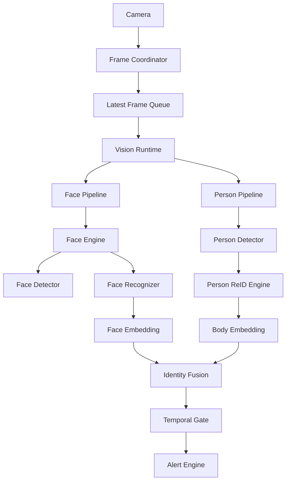
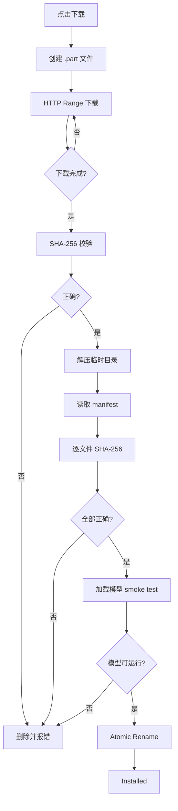
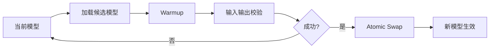
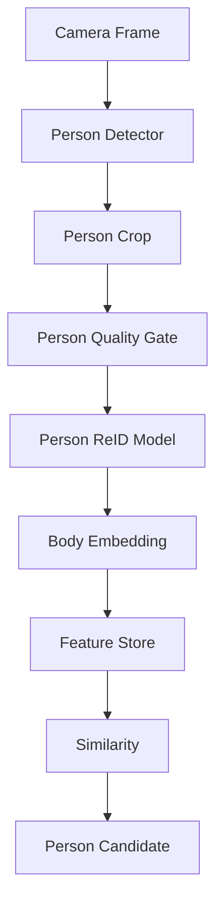
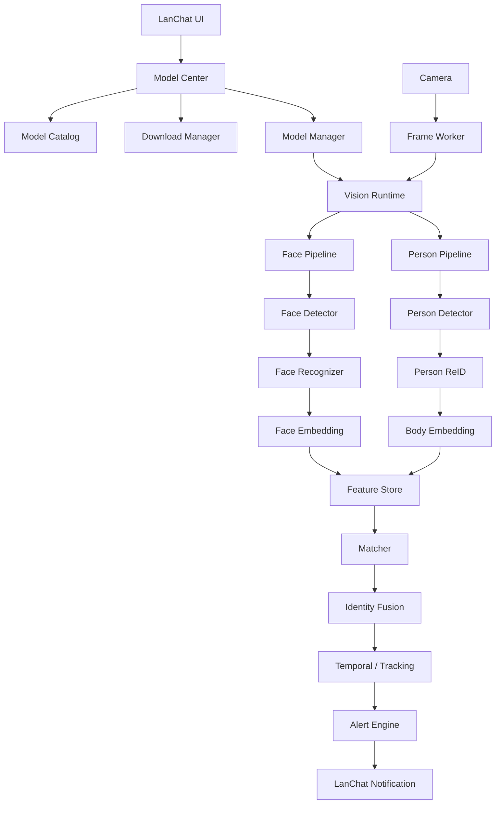

# LanChat 本地视觉识别系统重构与模型可插拔架构设计方案

> 适用项目：`DumKing/lanchat`
> 目标：在保持 **Rust + Tauri + 本地离线 AI + ONNX Runtime** 主体架构不变的前提下，将现有摄像头人脸识别能力重构为可扩展的本地视觉识别平台，支持人脸识别、人体 ReID、模型下载、安装、校验、切换、热加载、特征版本隔离及后续步态识别扩展。

---

## 1. 背景与现状

当前 LanChat 已经具备第一版本地摄像头人脸识别能力，核心技术链路为：

```text
WebView Camera
    ↓
cameraMediaCoordinator.ts
    ↓ JPEG Sample
Tauri IPC
    ↓
FaceMonitorRuntime
    ↓
YuNet
    ↓
Face Alignment
    ↓
SFace
    ↓
128D Embedding
    ↓
Cosine Similarity
    ↓
连续命中 / 冷却
    ↓
告警
```

当前实现已经具备以下良好基础：

- Rust 侧使用 ONNX Runtime 推理。
- YuNet 负责人脸检测。
- SFace 负责人脸特征提取。
- 模型通过 `manifest.json` 进行版本和 SHA-256 校验。
- 人脸特征只保存在本机。
- 摄像头帧只用于内存推理。
- 已具备人员特征缓存到 SQLite 的能力。
- 已具备 `embedding_model_version`，可以处理模型升级。
- 已具备采样 FPS、连续命中、冷却时间等基础告警策略。
- 摄像头监控与通话共用媒体轨道，避免重复占用摄像头。

当前代码主要集中在：

```text
src-tauri/src/face_monitor.rs
src-tauri/src/lib.rs
src-tauri/src/storage.rs

src/services/cameraMediaCoordinator.ts
src/services/tauri-api.ts
src/types/face-monitor.ts

src-tauri/resources/object-models/
```

现阶段架构适合作为 MVP，但如果继续增加：

```text
InsightFace
Open Model Zoo
ArcFace
SCRFD
OSNet
FastReID
人体属性
步态识别
多模型下载
模型切换
GPU Backend
```

如果不先抽象架构，后续很容易演变为：

```rust
if model == "sface" {
    ...
} else if model == "arcface" {
    ...
} else if model == "osnet" {
    ...
}
```

最终导致视觉代码、业务代码和模型逻辑严重耦合。

---

# 2. 重构目标

## 2.1 核心目标

本次重构最终需要达到：

```text
业务层不关心：

YuNet
SFace
SCRFD
ArcFace
OSNet
Open Model Zoo
InsightFace
embedding 维度
RGB / BGR
模型输入尺寸
模型输出名称
```

业务层只关心：

```text
检测到了谁
匹配分数是多少
是否满足告警条件
```

模型层则负责：

```text
模型下载
模型校验
模型加载
图像预处理
ONNX 推理
模型后处理
Embedding
相似度规则
模型切换
```

---

## 2.2 最终能力目标

### 人脸识别

支持：

```text
OpenCV Zoo
├── YuNet
└── SFace

InsightFace
├── SCRFD
└── ArcFace

Open Model Zoo
├── Face Detector
├── Landmark
└── ArcFace / Face ReID

自定义
└── ONNX Pipeline
```

### 人体特征识别

支持：

```text
Torchreid
├── OSNet x0.25
├── OSNet x0.5
├── OSNet x1.0
└── OSNet-AIN x1.0

Open Model Zoo
├── person-reidentification-retail-0288
├── 0287
├── 0286
└── 0277

FastReID
├── BoT
├── AGW
└── SBS
```

### 后续可扩展

```text
人体属性识别
步态识别
目标追踪
多摄像头 ReID
GPU 推理
DirectML
OpenVINO
TensorRT
```

---

# 3. 总体架构

建议将当前 `FaceMonitorRuntime` 升级为统一的：

```text
VisionRuntime
```

整体结构：



核心原则：

```text
Camera
    ↓
VisionRuntime
    ↓
可插拔 Pipeline
    ↓
统一 RecognitionResult
    ↓
告警业务
```

---

# 4. 分层设计

建议拆分为 6 层：

```text
┌─────────────────────────────────┐
│            业务层               │
│  Alert / Policy / Lan / UI      │
├─────────────────────────────────┤
│          Identity Layer         │
│ Matching / Fusion / Tracking    │
├─────────────────────────────────┤
│          Vision Pipeline        │
│ Face / Person / Gait            │
├─────────────────────────────────┤
│          Model Adapter          │
│ SFace / ArcFace / OSNet         │
├─────────────────────────────────┤
│       Inference Backend         │
│ ONNX Runtime / OpenVINO         │
├─────────────────────────────────┤
│        Model Management         │
│ Catalog / Download / Install    │
└─────────────────────────────────┘
```

---

# 5. Rust 目录重构

建议最终结构：

```text
src-tauri/src/
│
├── vision/
│   │
│   ├── mod.rs
│   ├── runtime.rs
│   ├── worker.rs
│   ├── frame.rs
│   ├── error.rs
│   ├── metrics.rs
│   │
│   ├── embedding/
│   │   ├── mod.rs
│   │   ├── vector.rs
│   │   ├── similarity.rs
│   │   └── space.rs
│   │
│   ├── preprocessing/
│   │   ├── mod.rs
│   │   ├── image.rs
│   │   ├── normalize.rs
│   │   └── letterbox.rs
│   │
│   ├── inference/
│   │   ├── mod.rs
│   │   ├── backend.rs
│   │   └── ort.rs
│   │
│   ├── face/
│   │   │
│   │   ├── mod.rs
│   │   ├── engine.rs
│   │   ├── types.rs
│   │   ├── alignment.rs
│   │   ├── quality.rs
│   │   │
│   │   └── providers/
│   │       ├── opencv/
│   │       │   ├── yunet.rs
│   │       │   └── sface.rs
│   │       │
│   │       ├── insightface/
│   │       │   ├── scrfd.rs
│   │       │   └── arcface.rs
│   │       │
│   │       └── omz/
│   │           ├── detector.rs
│   │           ├── landmark.rs
│   │           └── arcface.rs
│   │
│   ├── person/
│   │   │
│   │   ├── mod.rs
│   │   ├── engine.rs
│   │   ├── detector.rs
│   │   ├── quality.rs
│   │   │
│   │   └── providers/
│   │       ├── osnet.rs
│   │       ├── omz.rs
│   │       └── fastreid.rs
│   │
│   ├── tracking/
│   │   ├── mod.rs
│   │   ├── tracker.rs
│   │   └── track_state.rs
│   │
│   └── identity/
│       ├── mod.rs
│       ├── matcher.rs
│       ├── fusion.rs
│       └── temporal_gate.rs
│
├── models/
│   ├── mod.rs
│   ├── manifest.rs
│   ├── catalog.rs
│   ├── downloader.rs
│   ├── installer.rs
│   ├── verifier.rs
│   ├── registry.rs
│   ├── manager.rs
│   ├── switching.rs
│   └── storage.rs
│
├── camera_monitor.rs
│
├── storage.rs
├── network.rs
├── lib.rs
└── ...
```

---

# 6. 统一 Embedding 设计

当前实现中：

```rust
[f32; 128]
```

属于 SFace 专属实现。

必须改为动态维度。

建议：

```rust
#[derive(Debug, Clone)]
pub struct Embedding {
    pub space: EmbeddingSpaceId,
    pub values: Vec<f32>,
}
```

其中：

```rust
#[derive(Debug, Clone, Hash, PartialEq, Eq)]
pub struct EmbeddingSpaceId {
    pub provider: String,
    pub model_id: String,
    pub model_version: String,
}
```

例如：

```text
OpenCV / SFace / 2026.08-rgb1
InsightFace / w600k_r50 / buffalo-l-v1
OMZ / arcface-r100 / 2026.1
Torchreid / osnet-x1 / v1
```

---

## 6.1 禁止跨模型比较

即使两个模型都是：

```text
512D
```

也不能直接比较。

例如：

```text
InsightFace ArcFace R50
        VS
OMZ ArcFace R100
```

必须禁止。

匹配前：

```rust
if probe.space != template.space {
    return Err(VisionError::EmbeddingSpaceMismatch);
}
```

---

# 7. FaceEngine 抽象

建议：

```rust
pub trait FaceEngine: Send + Sync {
    fn descriptor(&self) -> &PipelineDescriptor;

    fn detect(
        &self,
        image: &image::RgbImage,
    ) -> Result<Vec<FaceDetection>, VisionError>;

    fn extract(
        &self,
        image: &image::RgbImage,
        face: &FaceDetection,
    ) -> Result<Embedding, VisionError>;

    fn warmup(&self) -> Result<(), VisionError>;
}
```

业务层只使用：

```rust
let faces = engine.detect(&frame)?;
let embedding = engine.extract(&frame, face)?;
```

而不用知道：

```text
YuNet
SCRFD
ArcFace
SFace
```

---

# 8. PersonReIdEngine 抽象

人体识别：

```rust
pub trait PersonReIdEngine: Send + Sync {
    fn descriptor(&self) -> &PipelineDescriptor;

    fn extract(
        &self,
        image: &image::RgbImage,
        region: &PersonRegion,
    ) -> Result<Embedding, VisionError>;

    fn warmup(&self) -> Result<(), VisionError>;
}
```

第一版建议支持：

```text
OSNet x0.25
OSNet x0.5
OSNet x1.0
OSNet-AIN x1.0

OMZ 0288
OMZ 0277
```

---

# 9. 不建议每个模型都写一个 Engine

例如不要：

```text
OsNet025Engine
OsNet05Engine
OsNet1Engine
OsNetAINEngine
```

更推荐：

```text
GenericOnnxReIdEngine
        +
ModelDescriptor
```

即：

```rust
let engine = OnnxPersonReIdEngine::load(
    manifest
)?;
```

模型差异由 Manifest 描述。

---

# 10. 模型 Manifest V3

当前 Manifest 可以升级为：

```json
{
  "schemaVersion": 3,

  "id": "insightface-buffalo-l",
  "name": "InsightFace Buffalo L",
  "provider": "insightface",
  "version": "1.0.0",

  "category": "face-pipeline",

  "backend": "onnxruntime",

  "license": {
    "name": "InsightFace Model License",
    "usage": "non-commercial-research",
    "url": "https://github.com/deepinsight/insightface"
  },

  "components": {
    "detector": {
      "type": "scrfd",
      "file": "det_10g.onnx",
      "sha256": "...",

      "input": {
        "width": 640,
        "height": 640,
        "layout": "NCHW",
        "channelOrder": "RGB",

        "resizeMode": "letterbox",

        "normalization": {
          "scale": 1.0,
          "mean": [127.5, 127.5, 127.5],
          "std": [128.0, 128.0, 128.0]
        }
      }
    },

    "recognizer": {
      "type": "arcface",
      "file": "w600k_r50.onnx",
      "sha256": "...",

      "input": {
        "width": 112,
        "height": 112,
        "layout": "NCHW",
        "channelOrder": "RGB",

        "normalization": {
          "scale": 1.0,
          "mean": [127.5, 127.5, 127.5],
          "std": [128.0, 128.0, 128.0]
        }
      },

      "output": {
        "dimension": 512,
        "normalize": "l2"
      }
    }
  },

  "matching": {
    "metric": "cosine",
    "recommendedThreshold": 0.45,
    "top2Margin": 0.08
  }
}
```

---

# 11. Manifest 通用输入描述

建议：

```rust
pub struct TensorInputSpec {
    pub width: usize,
    pub height: usize,

    pub layout: TensorLayout,
    pub channel_order: ChannelOrder,
    pub resize_mode: ResizeMode,

    pub normalization: NormalizationSpec,
}
```

枚举：

```rust
pub enum ChannelOrder {
    Rgb,
    Bgr,
}

pub enum TensorLayout {
    Nchw,
    Nhwc,
}

pub enum ResizeMode {
    Stretch,
    Letterbox,
    KeepAspect,
}
```

这样可以统一支持：

```text
YuNet
SCRFD
SFace
ArcFace
OSNet
OMZ ReID
YOLO
```

---

# 12. 模型 Catalog

Manifest 描述：

```text
如何运行一个模型
```

Catalog 描述：

```text
有哪些模型可以下载
```

建议本地：

```text
resources/model-catalog.json
```

同时允许远程更新。

示例：

```json
{
  "schemaVersion": 1,
  "catalogVersion": "2026.08.1",

  "models": [
    {
      "id": "opencv-yunet-sface",
      "name": "OpenCV YuNet + SFace",

      "provider": "opencv",

      "category": "face-pipeline",

      "profile": "light",

      "description": "轻量级本地人脸识别方案",

      "download": {
        "type": "zip",
        "url": "...",
        "sha256": "..."
      }
    },

    {
      "id": "insightface-buffalo-l",
      "name": "InsightFace Buffalo L",

      "provider": "insightface",

      "category": "face-pipeline",

      "profile": "high-accuracy",

      "download": {
        "type": "zip",
        "url": "...",
        "sha256": "..."
      }
    },

    {
      "id": "osnet-x025",
      "name": "OSNet x0.25",

      "provider": "torchreid",

      "category": "person-reid",

      "profile": "ultralight",

      "download": {
        "type": "zip",
        "url": "...",
        "sha256": "..."
      }
    }
  ]
}
```

---

# 13. ModelManager

建议核心 API：

```rust
pub struct ModelManager {
    catalog: ModelCatalog,
    registry: ModelRegistry,
    installer: ModelInstaller,
}
```

提供：

```rust
list_available_models()

list_installed_models()

download_model()

pause_download()

resume_download()

cancel_download()

install_model()

verify_model()

delete_model()

activate_model()

get_active_model()

check_model_updates()
```

---

# 14. 模型存储目录

建议：

```text
%AppData%/
└── LanChat/
    └── ai/
        │
        ├── catalog/
        │   ├── catalog.json
        │   └── catalog.sig
        │
        ├── downloads/
        │   ├── buffalo_l.zip.part
        │   └── osnet_x1.zip.part
        │
        └── models/
            │
            ├── face/
            │   ├── opencv-yunet-sface/
            │   │   └── 2026.08/
            │   │
            │   └── insightface-buffalo-l/
            │       └── 1.0/
            │
            └── person/
                ├── osnet-x025/
                │   └── 1.0/
                │
                └── omz-0288/
                    └── 1.0/
```

---

# 15. 下载与安装流程

推荐：



---

# 16. 下载安全

即使是学习软件，也建议做好基础供应链安全。

## 16.1 Catalog 签名

```text
catalog.json
catalog.sig
```

程序内置：

```text
Ed25519 Public Key
```

验证：

```text
Catalog Signature
      ↓
Model Download URL
      ↓
Package SHA256
      ↓
Manifest
      ↓
Individual Model SHA256
```

---

# 17. 模型切换机制

不能直接：

```text
drop 旧模型
→ load 新模型
```

推荐：



Runtime：

```rust
pub struct VisionRuntime {
    active_face:
        Arc<RwLock<Arc<dyn FaceEngine>>>,

    active_person:
        Arc<RwLock<Option<Arc<dyn PersonReIdEngine>>>>,
}
```

每帧：

```rust
let engine = runtime.active_face_engine();
```

拿到：

```text
Arc<dyn FaceEngine>
```

旧帧继续使用旧模型，新帧自动使用新模型。

---

# 18. 模型切换与 Embedding

切换：

```text
SFace
   ↓
ArcFace
```

不能继续使用 SFace embedding。

推荐数据库缓存多个 Embedding Space。

---

# 19. 数据库重构

## 19.1 人员主表

```sql
CREATE TABLE face_people (
    person_id TEXT PRIMARY KEY,
    display_name TEXT NOT NULL,

    enabled INTEGER NOT NULL DEFAULT 1,

    expires_at INTEGER,

    created_at INTEGER NOT NULL,
    updated_at INTEGER NOT NULL,
    deleted_at INTEGER
);
```

---

## 19.2 参考照片

建议支持多照片。

```sql
CREATE TABLE person_reference_images (
    id TEXT PRIMARY KEY,

    person_id TEXT NOT NULL,

    file_path TEXT NOT NULL,
    sha256 TEXT NOT NULL,

    quality_score REAL,

    created_at INTEGER NOT NULL
);
```

一个人建议：

```text
3 ~ 5 张
```

例如：

```text
正脸
轻微左侧
轻微右侧
戴眼镜
不戴眼镜
```

---

## 19.3 特征表

```sql
CREATE TABLE person_embeddings (
    id TEXT PRIMARY KEY,

    person_id TEXT NOT NULL,

    source_image_id TEXT,

    modality TEXT NOT NULL,

    provider TEXT NOT NULL,
    model_id TEXT NOT NULL,
    model_version TEXT NOT NULL,

    dimension INTEGER NOT NULL,

    embedding BLOB NOT NULL,

    quality REAL,

    created_at INTEGER NOT NULL
);
```

其中：

```text
modality:

face
body
gait
```

---

## 19.4 索引

```sql
CREATE INDEX idx_person_embeddings_lookup
ON person_embeddings(
    modality,
    provider,
    model_id,
    model_version,
    person_id
);
```

---

# 20. 特征缓存

摄像头运行时不要每帧读取 SQLite。

建议：

```rust
pub struct FeatureStore {
    face_templates:
        Arc<RwLock<HashMap<EmbeddingSpaceId, Arc<Vec<PersonTemplate>>>>>,

    body_templates:
        Arc<RwLock<HashMap<EmbeddingSpaceId, Arc<Vec<PersonTemplate>>>>>,
}
```

只有以下事件刷新：

```text
人员新增
人员删除
人员禁用
照片变化
模型切换
模型升级
远端策略同步
Embedding 重算
```

---

# 21. 摄像头采集优化

当前路径：

```text
Camera
 ↓
320px
 ↓
JPEG 0.72
 ↓
Rust
 ↓
放大 640
```

建议改为：

```text
Camera
 ↓
640px / 720px
 ↓
JPEG 0.82 ~ 0.88
 ↓
Rust
```

普通监控：

```text
640 longest side
```

视频通话期间：

```text
320 / 480
```

---

# 22. 图像不要强行拉伸为 640×640

建议：

```text
16:9
640×360
```

使用：

```text
Letterbox
```

变成：

```text
640×640
```

而不是 Stretch。

记录：

```rust
pub struct LetterboxMeta {
    pub scale: f32,
    pub pad_x: f32,
    pub pad_y: f32,
}
```

坐标还原：

```text
x = (model_x - pad_x) / scale
y = (model_y - pad_y) / scale
```

---

# 23. JPEG 只解码一次

当前识别路径应改为：

```rust
fn recognize_bytes(bytes: &[u8]) {
    let image = decode(bytes)?;

    let detections =
        detector.detect(&image)?;

    for detection in detections {
        recognizer.extract(
            &image,
            &detection,
        )?;
    }
}
```

避免：

```text
JPEG Decode
→ Detector

JPEG Decode
→ Recognizer
```

---

# 24. Tauri IPC 优化

避免：

```ts
Array.from(sample.bytes)
```

造成：

```text
Uint8Array
    ↓
number[]
    ↓
JSON / serde
```

建议 Tauri Raw IPC：

```text
ArrayBuffer
      ↓
InvokeBody::Raw
```

或者后续将摄像头采样也迁到 Rust。

---

# 25. AI Worker

推理不要直接跑在普通 Tokio async worker 中。

建议独立 AI Worker。

```text
Camera
   ↓
LatestFrameSlot
   ↓
AI Thread
   ↓
VisionRuntime
   ↓
Result Channel
   ↓
Tauri Event
```

---

## 25.1 Latest Frame Wins

摄像头识别不是视频编码，不需要逐帧处理。

如果：

```text
Frame 1 处理中

Frame 2
Frame 3
Frame 4
```

应该：

```text
1 → 4
```

而不是：

```text
1 → 2 → 3 → 4
```

队列建议：

```text
capacity = 1
```

或者：

```text
Atomic Latest Frame
```

---

# 26. Face Quality Gate

进入识别前增加质量控制。

判断：

```text
人脸尺寸
模糊度
曝光
关键点可信度
侧脸角度
遮挡
是否超出边界
```

例如：

```text
face_width < 48px
→ 不识别
```

否则：

```text
20×20
 ↓
Resize 112
 ↓
SFace / ArcFace
```

容易产生错误 embedding。

---

# 27. 人体 Quality Gate

Person ReID 也应该做：

```text
BBox 过小
人体截断
只有上半身
严重遮挡
过暗
运动模糊
```

人体 ReID 建议只有满足：

```text
人物高度 > 120px
可见比例 > 70%
```

才提取 embedding。

具体阈值需通过实际摄像头数据校准。

---

# 28. 真正的 Consecutive Hits

当前连续命中概念建议重构。

状态：

```rust
pub struct HitGateState {
    pub consecutive_hits: u8,

    pub last_hit_at: i64,

    pub last_frame_id: u64,

    pub last_alert_at: i64,
}
```

只有：

```text
当前帧
      ↓
上一帧或允许跳过极少量帧
```

才累计。

如果：

```text
miss
```

则：

```text
hits = 0
```

---

# 29. Top1 / Top2 Margin

不能只看：

```text
最高 similarity
```

例如：

```text
王某 0.62
李某 0.61
```

不应该直接认为是王某。

推荐：

```text
Top1 >= Threshold

AND

Top1 - Top2 >= Margin
```

例如：

```text
Top1 = 0.68
Top2 = 0.40

Margin = 0.28
```

可信度明显更高。

---

# 30. 不要把 cosine similarity 直接称为百分比置信度

例如：

```text
similarity = 0.62
```

不等于：

```text
62% 概率
```

内部建议：

```rust
pub struct MatchScore {
    pub similarity: f32,
    pub second_best: Option<f32>,
    pub margin: Option<f32>,
}
```

UI：

```text
相似度：0.62
```

而不是：

```text
置信度：62%
```

后续如果有真实样本数据，可以再做概率校准。

---

# 31. 人体 ReID 架构

人体识别流程：



---

# 32. 首批人体模型建议

建议第一批只支持：

```text
Torchreid

OSNet x0.25
OSNet x0.5
OSNet x1.0
OSNet-AIN x1.0


Open Model Zoo

Person ReID 0288
Person ReID 0277
```

UI：

```text
人体识别模型

○ 极速
  OSNet x0.25

● 均衡
  OSNet x0.5

○ 高精度
  OSNet x1.0

○ 跨环境
  OSNet-AIN x1.0

○ Intel 极轻量
  OMZ 0288

○ Intel 高精度
  OMZ 0277
```

---

# 33. 人脸模型建议

首批：

```text
OpenCV Zoo
YuNet + SFace

InsightFace
Buffalo SC
Buffalo S
Buffalo L

Open Model Zoo
ArcFace R100
```

---

# 34. 模型分类

Catalog 中建议定义：

```rust
pub enum ModelCategory {
    FacePipeline,
    FaceDetector,
    FaceRecognizer,

    PersonDetector,
    PersonReId,

    PersonAttribute,

    GaitRecognition,
}
```

---

# 35. Identity Fusion

最终不要把：

```text
Face
Body
```

分别直接告警。

统一进入 Identity Fusion。

```text
Face Similarity
        │
        ├─────────────┐
                      ▼
                 Identity
                      ▲
        ├─────────────┘
Body Similarity
```

---

## 35.1 建议融合策略

优先级：

```text
Face
>
Body
>
Tracking
>
Gait
```

第一版推荐规则法，不需要训练融合模型。

例如：

```text
Face >= strong threshold
→ MATCH

Face >= normal threshold
AND
Body >= body threshold
→ MATCH

Face unavailable
AND
Body >= strong body threshold
AND
连续多帧
→ POSSIBLE MATCH
```

---

# 36. RecognitionResult

统一输出：

```rust
pub struct RecognitionResult {
    pub frame_id: u64,

    pub person_id: Option<String>,

    pub face: Option<FaceMatchResult>,

    pub body: Option<PersonMatchResult>,

    pub fused_score: f32,

    pub decision: IdentityDecision,
}
```

Decision：

```rust
pub enum IdentityDecision {
    Unknown,

    Ambiguous,

    PossibleMatch,

    Match,
}
```

---

# 37. Tracking

后续建议增加简单 Tracking。

目的不是复杂视频分析，而是：

```text
避免同一个人在连续帧中重复做全量识别
```

流程：

```text
Person Detector
      ↓
Tracker
      ↓
Track ID
      ↓
第一次或定期 ReID
```

例如：

```text
Track 7
```

已经识别为：

```text
王某
```

后续 1 秒内不需要每帧重新跑 ArcFace / OSNet。

---

# 38. 模型阈值必须与模型绑定

不要全局：

```text
minConfidence = 60
```

应该：

```text
Face Threshold

按模型
```

例如：

```text
opencv-sface
0.36

insightface-buffalo-l
0.45

omz-arcface
0.50
```

这里只是配置示例，最终值必须通过实际测试集校准。

数据库：

```sql
CREATE TABLE model_matching_profiles (
    model_id TEXT NOT NULL,
    model_version TEXT NOT NULL,

    threshold REAL NOT NULL,
    top2_margin REAL NOT NULL,

    PRIMARY KEY(model_id, model_version)
);
```

---

# 39. 模型测试页面

强烈建议增加：

```text
模型实验室
```

显示：

```text
当前 Face Pipeline

InsightFace Buffalo L

Detector:
SCRFD

Recognizer:
ArcFace R50

Embedding:
512D

Backend:
ONNX Runtime
```

实时：

```text
检测耗时
识别耗时
总耗时
FPS

人脸检测分数

Top1
Top2
Margin

Face Similarity
Body Similarity

最终 Identity Decision
```

---

# 40. 模型性能指标

建议 runtime 维护：

```rust
pub struct VisionMetrics {
    pub frames_received: u64,

    pub frames_processed: u64,

    pub frames_dropped: u64,

    pub avg_decode_ms: f32,

    pub avg_detect_ms: f32,

    pub avg_face_recognition_ms: f32,

    pub avg_body_reid_ms: f32,

    pub avg_total_ms: f32,
}
```

设置页面可显示：

```text
AI 性能

采样：2 FPS

平均处理：
42 ms

Face Detection：
16 ms

Face Recognition：
12 ms

Person ReID：
10 ms

Dropped：
3
```

---

# 41. CPU / GPU Backend

第一阶段：

```text
ONNX Runtime CPU
```

后续再增加：

```text
CUDA
DirectML
OpenVINO
TensorRT
```

建议现在就抽象：

```rust
pub trait InferenceBackend:
    Send + Sync
{
    fn load(
        &self,
        path: &Path,
        config: &SessionConfig,
    ) -> Result<
        Box<dyn ModelSession>,
        VisionError
    >;
}
```

第一版：

```text
OrtBackend
```

---

# 42. Session 配置

建议 Manifest 或本地设置支持：

```text
threads
execution provider
graph optimization
memory arena
```

例如：

```rust
pub struct SessionConfig {
    pub intra_threads: usize,

    pub inter_threads: usize,

    pub provider: ExecutionProvider,
}
```

默认：

```text
Auto
```

---

# 43. 模型加载时 Warmup

首次推理通常更慢。

切换模型：

```text
load
 ↓
warmup
 ↓
verify
 ↓
activate
```

Warmup：

```text
Face Detector:
640×640 zero tensor

Face Recognizer:
112×112 zero tensor

OSNet:
256×128 zero tensor
```

---

# 44. 模型失败回滚

例如：

```text
用户切换 Buffalo L

        ↓

模型加载失败
```

必须：

```text
继续保持原模型
```

不能导致：

```text
VisionRuntime unavailable
```

所以：

```text
CandidateRuntime
       ↓
成功
       ↓
swap
```

而不是原地 reload。

---

# 45. expiresAt 必须生效

人员查询和内存模板加载必须过滤：

```text
enabled = true

AND

deleted_at IS NULL

AND

(
 expires_at IS NULL
 OR
 expires_at > now
)
```

---

# 46. 参考照片多人处理

参考照片：

```text
0 张人脸
→ 拒绝

1 张
→ 自动

>1 张
→ 要求用户选择或拒绝
```

不要自动选：

```text
detector score 最大的人
```

---

# 47. 多参考照片

最终建议支持：

```text
王某

├── reference 1
├── reference 2
├── reference 3
├── reference 4
└── reference 5
```

匹配：

```text
probe
  ↓
和王某所有模板比较
  ↓
max / top-k average
```

推荐：

```text
max
```

第一版最简单。

后续可：

```text
top-2 average
```

---

# 48. 模型升级

模型版本变化：

```text
Buffalo L v1
        ↓
Buffalo L v2
```

不能继续使用：

```text
v1 embeddings
```

但不需要删除。

数据库继续保存：

```text
v1
v2
```

当前 runtime：

```text
只加载 v2
```

回滚模型时：

```text
v1 embedding
```

仍然可用。

---

# 49. Embedding 重算任务

模型切换时不要一次阻塞 UI。

建议：

```text
Background Feature Build
```

状态：

```text
Waiting
Processing
Ready
Failed
```

例如：

```text
正在为 InsightFace Buffalo L
生成本地人员特征

17 / 23
```

---

# 50. 模型激活状态

建议：

```rust
pub enum ModelInstallState {
    NotInstalled,

    Downloading,

    Paused,

    Installed,

    Activating,

    Active,

    Invalid,

    UpdateAvailable,
}
```

---

# 51. 前端模型中心

建议设置页面：

```text
AI 模型中心
```

---

## 人脸识别

```text
当前：
InsightFace Buffalo S

● InsightFace Buffalo S
  均衡
  已安装
  当前使用

○ OpenCV YuNet + SFace
  轻量
  已安装
  [切换]

○ InsightFace Buffalo L
  高精度
  326 MB
  [下载]

○ OMZ ArcFace R100
  高精度
  [下载]
```

---

## 人体 ReID

```text
当前：
OSNet x0.5

○ OSNet x0.25
  极低资源

● OSNet x0.5
  当前使用

○ OSNet x1.0
  高精度

○ OSNet-AIN x1.0
  跨环境

○ OMZ 0288
  Intel 轻量

○ OMZ 0277
  Intel 高精度
```

---

# 52. 普通模式与高级模式

普通模式：

```text
AI 性能模式

○ 低资源
● 均衡
○ 高精度
```

后台映射：

```text
低资源

Face:
OpenCV YuNet + SFace

Body:
OSNet x0.25
```

均衡：

```text
Face:
InsightFace Buffalo S

Body:
OSNet x0.5
```

高精度：

```text
Face:
InsightFace Buffalo L

Body:
OSNet-AIN x1.0
```

---

高级模式：

```text
Face Pipeline
[ InsightFace Buffalo L ]

Body ReID
[ OSNet-AIN x1.0 ]

Backend
[ ONNX Runtime ]

Device
[ Auto ]

Face Threshold
[ 0.45 ]

Body Threshold
[ 0.68 ]

Top2 Margin
[ 0.08 ]
```

---

# 53. Tauri Commands

建议增加：

```text
list_ai_model_catalog

list_installed_ai_models

download_ai_model

pause_ai_model_download

resume_ai_model_download

cancel_ai_model_download

delete_ai_model

activate_face_model

activate_person_reid_model

get_active_ai_models

get_ai_model_download_state

verify_ai_model

get_vision_runtime_status

get_vision_metrics

rebuild_person_embeddings
```

---

# 54. Tauri Events

建议：

```text
ai_model_download_progress

ai_model_install_state

ai_model_activated

ai_model_activation_failed

vision_runtime_status

vision_metrics_updated

person_embedding_build_progress

camera_identity_detected
```

---

# 55. ModelRegistry

建议：

```rust
pub struct ModelRegistry {
    installed:
        HashMap<String, InstalledModel>,

    active_face:
        Option<ModelRef>,

    active_person:
        Option<ModelRef>,
}
```

写入：

```text
ai-state.json
```

或者 SQLite。

---

# 56. 模型下载失败恢复

下载使用：

```text
*.part
```

例如：

```text
buffalo-l.zip.part
```

启动时：

```text
读取未完成下载
```

用户可：

```text
继续
删除
```

支持 HTTP Range。

---

# 57. 模型资源不要放 Git Repository

现有 SFace 模型约几十 MB。

未来：

```text
Buffalo L
OSNet
OMZ
```

会越来越大。

建议以后：

```text
GitHub Release Assets
```

或者自定义下载源。

仓库只保留：

```text
Catalog
Manifest Template
README
```

默认轻量模型可以继续随安装包携带。

---

# 58. 默认模型

建议默认：

```text
Face

OpenCV
YuNet + SFace
```

原因：

```text
轻量
已有实现
无需额外下载
```

人体 ReID：

```text
默认未安装
```

用户开启：

```text
人体辅助识别
```

时提示：

```text
请选择人体模型
```

推荐：

```text
OSNet x0.25
```

---

# 59. 隐私设计

继续保持当前原则：

```text
摄像头 Frame
只在本机内存

Reference Photo
只在本机

Face Embedding
只在本机

Body Embedding
只在本机
```

网络告警：

```text
只发送：

person_id
person_name
match score
timestamp
source device
```

不要自动传：

```text
照片
摄像头截图
embedding
```

---

# 60. 模型 License

模型 Catalog 建议必须带：

```json
"license": {
  "name": "...",
  "usage": "...",
  "url": "..."
}
```

UI 显示：

```text
模型许可证

仅学习 / 非商业使用
```

即使当前项目只是个人学习，也建议在模型中心清楚标识。

---

# 61. 当前实现必须优先修复的问题

正式做模型平台之前，建议先完成以下 P0。

---

## P0-1 SFace RGB 输入修正

现有 RGB 图片不要重新变成：

```text
BGR
```

送 SFace。

建议改成模型 Manifest 控制：

```json
"channelOrder": "RGB"
```

同时提升：

```text
modelVersion
```

触发旧特征重新生成。

---

## P0-2 Consecutive Hit 修正

Miss 必须清空：

```text
consecutive_hits
```

不能出现：

```text
10 秒前命中一次

10 秒后命中一次

被认为连续 2 次
```

---

## P0-3 expiresAt

过期人员不能继续参与识别。

---

## P0-4 多人参考照片

参考照片多脸时不允许自动录错人。

---

# 62. P1 性能优化

```text
320 → 640 Camera Sample

Letterbox

JPEG decode once

Raw IPC

FeatureStore Memory Cache

AI Worker

Latest Frame Wins

Quality Gate
```

---

# 63. P2 精度优化

```text
多参考照片

Top1 / Top2 Margin

Face Quality

Body Quality

Person Tracking

Face + Body Fusion
```

---

# 64. P3 模型平台

```text
Model Manifest V3

Model Catalog

Download Manager

Installer

Verifier

Hot Switching

Model Version Isolation
```

---

# 65. P4 多模型

```text
InsightFace

Open Model Zoo

OSNet

OSNet-AIN

FastReID
```

---

# 66. P5 后续扩展

```text
人体属性识别

Gait Recognition

GPU Backend

DirectML

OpenVINO

多摄像头 ReID

本地向量索引
```

---

# 67. Golden Test

必须增加与官方实现的基准对照测试。

建议：

```text
tests/data/

person_a_1.jpg
person_a_2.jpg
person_b.jpg
```

保存官方实现输出：

```text
bbox
landmarks
embedding
similarity
```

Rust 测试：

```text
Detector

bbox error
< tolerance
```

```text
Recognizer

cosine(
  Rust Embedding,
  Reference Embedding
)

> 0.999
```

---

# 68. 模型 Smoke Test

安装模型后：

```text
ONNX 是否能加载

输入数量是否一致

输出数量是否一致

Embedding Dimension

输出是否包含 NaN

输出 norm 是否合理
```

失败：

```text
Invalid Model
```

不允许激活。

---

# 69. Benchmark

建议每个模型自动 Benchmark：

```text
CPU

Face Detector
ms/frame

Face Recognizer
ms/face

Person ReID
ms/person

Memory
MB
```

模型中心显示：

```text
本机测试

平均：
23ms

约：
43 FPS

内存：
210 MB
```

比只显示官方 benchmark 更有意义。

---

# 70. Runtime 自适应

可以进一步：

```text
CPU 高负载

→ 降低采样 FPS
```

例如：

```text
正常：

2 FPS

视频通话：

1 FPS

CPU 高：

0.5 ~ 1 FPS
```

现有配置至少 1FPS 时，可以通过：

```text
每 N 个 timer tick 跳过
```

实现更低的 AI 推理频率。

---

# 71. 未来 Vector Index

目前：

```text
几十
几百
```

个人模板直接内存遍历即可。

如果以后：

```text
> 5000
```

再考虑：

```text
HNSW
```

但现阶段：

```text
Vec + cosine
```

更简单、更可靠。

---

# 72. 推荐实施迭代

---

## Iteration 1：核心抽象

目标：

```text
不改变现有功能
```

完成：

```text
vision/

FaceEngine

Embedding

EmbeddingSpaceId

InferenceBackend

Preprocessing

SFace Adapter

YuNet Adapter
```

同时完成：

```text
SFace RGB 修复

true consecutive hit

expiresAt

decode once

letterbox
```

---

## Iteration 2：Feature Store

完成：

```text
person_reference_images

person_embeddings

多参考照片

多模型 Embedding

内存 FeatureStore

Top1 / Top2 Margin
```

---

## Iteration 3：Model Center

完成：

```text
Manifest V3

Catalog

Download

Resume

SHA256

Install

Delete

Activate

Atomic Swap
```

---

## Iteration 4：InsightFace

支持：

```text
Buffalo SC

Buffalo S

Buffalo L
```

能力：

```text
SCRFD

ArcFace

512D

模型切换
```

---

## Iteration 5：Person ReID

加入：

```text
Person Detector

OSNet x0.25

OSNet x0.5

OSNet x1.0

OSNet-AIN
```

实现：

```text
Face + Body Fusion
```

---

## Iteration 6：Open Model Zoo

加入：

```text
OMZ ArcFace

OMZ ReID 0288

OMZ ReID 0277
```

---

## Iteration 7：高级能力

加入：

```text
Tracking

FastReID

Person Attributes

Gait

GPU Backend
```

---

# 73. 每个迭代的兼容策略

每次数据库升级：

```text
必须 Migration
```

不要：

```text
删除旧数据
```

旧：

```text
face_people.embedding
```

可以迁移为：

```text
person_embeddings

provider = opencv
model_id = sface
modality = face
```

---

# 74. 最终核心接口

建议 Vision Runtime 最终对业务只提供：

```rust
pub trait IdentityRecognitionService:
    Send + Sync
{
    fn recognize(
        &self,
        frame: VisionFrame,
    ) -> Result<
        Vec<RecognitionResult>,
        VisionError
    >;
}
```

业务：

```rust
let results =
    vision.recognize(frame)?;

for result in results {
    alert_engine.process(result)?;
}
```

业务完全不需要知道：

```text
ArcFace
SFace
OSNet
SCRFD
YuNet
```

---

# 75. 最终架构形态



---

# 76. 最终推荐模型组合

## 低资源模式

```text
Face:
YuNet + SFace

Body:
OSNet x0.25

FPS:
1 ~ 2
```

---

## 均衡模式

```text
Face:
InsightFace Buffalo S

Body:
OSNet x0.5

FPS:
2
```

---

## 高精度模式

```text
Face:
InsightFace Buffalo L

Body:
OSNet-AIN x1.0

FPS:
2 ~ 3
```

---

## 实验模式

```text
Face:
OMZ ArcFace R100

Body:
FastReID SBS

Backend:
ONNX Runtime
```

---

# 77. 最终结论

LanChat 当前的人脸识别实现不需要推翻。

最佳演进路径不是重新做一套 AI 系统，而是：

```text
当前

FaceMonitorRuntime

      ↓

重构

VisionRuntime

      ↓

抽象

FaceEngine
PersonReIdEngine

      ↓

模型描述

Manifest

      ↓

模型管理

Catalog
Download
Verify
Install
Switch

      ↓

统一推理

ONNX Runtime

      ↓

统一特征

EmbeddingSpace

      ↓

统一识别

Identity Fusion
```

最终达到：

```text
Face Model

OpenCV
InsightFace
Open Model Zoo
Custom ONNX

        +

Body ReID

OSNet
OMZ
FastReID

        ↓

LanChat Identity Engine
```

模型差异只存在于：

```text
Manifest
Adapter
ONNX Model
```

摄像头、人员管理、告警、局域网消息、桌宠和 UI 业务都不需要因为模型变化而重新改造。

这将使 LanChat 从当前的：

```text
“内置一套人脸识别能力”
```

逐步演化为：

```text
“本地离线、可下载、可切换、可扩展的视觉识别运行时”
```

同时仍然保持：

```text
Rust 主程序
本地离线
无 Python Runtime
ONNX Runtime
模型可插拔
特征不出本机
```
