# LanChat 全量原生 UI 迁移设计

## 目标

将 LanChat 的主界面从 Tauri + Vue + WebView2 全量迁移为 Rust 原生 UI，消除主聊天界面的 Chromium 渲染进程，同时保持现有局域网协议、本地数据、桌宠和游戏能力兼容。

## 已确认的范围

- 主界面使用 Slint + Rust，不再依赖 Vue 或 WebView2。
- 聊天、设备、频道、设置、桌宠设置、狼来了排行榜和全部内置游戏均迁移为原生界面。
- 语音和视频通话也迁移为 Rust 原生实现；Windows 是首个完整交付平台。
- 现有 SQLite 数据库、设备 MAC 标识、mDNS/TCP 协议、频道密钥、消息格式、游戏记录和桌宠配置必须直接兼容。
- 聊天默认仅加载最近 20 条消息，向上滚动时按 20 条分页加载。
- 图片先显示缩略图，原图在用户点击预览后才解码；头像导入时压缩为本地资源。

## 非目标

- 不在第一阶段为 macOS/Linux 提供原生摄像头、麦克风、扬声器完整实现。
- 不改变局域网发现、私有频道加密、设备认证或游戏规则。
- 不进行新的服务端/HUB 架构改造。

## 架构

```mermaid
flowchart LR
  UI[Slint Native UI] --> APP[Application Services]
  APP --> STORE[SQLite Storage]
  APP --> NET[mDNS and TCP Network]
  APP --> FILE[File and Media Cache]
  APP --> PET[Desktop Pet Controller]
  APP --> GAME[Game Services]
  APP --> CALL[Native WebRTC Call Service]
  CALL --> WIN[Windows Device Capture and Playback]
```

### 原生应用服务层

新增 `native_app` 模块，作为 UI 与现有领域模块之间的唯一入口：

- 维护当前页面、活动会话、会话消息页、设备/频道列表和未读数。
- 将网络事件转换为可观察的 UI 事件。
- 提供发送消息、文件、图片、频道管理、告警反馈、游戏操作和通话控制方法。
- 复用 `Storage`、`Network`、`FileServer`、`DesktopPetManager` 与现有游戏状态，不在 UI 层直接访问数据库或 socket。

### 原生 UI

Slint 按页面拆分为：

- 聊天：三栏布局、可调整列表宽度、原生虚拟消息列表、输入器和频道成员面板。
- 设备：设备列表与右侧详情，含在线状态、备注、管理员能力和频道信息。
- 设置：基础、桌宠、狼来了、通话权限、外部推送和管理员设置。
- 游戏：斗地主、五子棋、中国象棋、扫雷竞速，沿用现有同步规则。
- 通话：独立、不透明、可跨屏移动的原生音视频窗口。

### 媒体与内存控制

- 每个会话缓存最多一个当前 20 条消息页和少量前序页；切换后释放非活跃纹理。
- 图片缓存保存原文件和缩略图，采用容量上限与最近最少使用淘汰。
- 头像从上传文件压缩为固定尺寸本地资源，网络仍以协议支持的内容通知，但 UI 不重复保留 Base64 副本。
- 视频帧只在通话窗口可见时上传纹理；挂断后停止设备、释放轨道、音频缓冲和纹理。

### 原生通话

- 使用 Rust WebRTC 实现 offer/answer/ICE，继续通过现有 LAN TCP 信令帧传播。
- Windows 首期接入麦克风、摄像头和扬声器；权限拒绝、设备缺失、占用和连接失败保留可恢复状态。
- 通话状态由 `CallService` 单点维护，主窗口、桌宠来电提示和独立通话窗只订阅同一状态，避免重复处理信令。

## 数据兼容

- 不变更 `lanchat.sqlite3` 存储路径及既有表结构语义。
- 不变更 MAC 设备标识、消息 ID、会话 ID、频道 ID 和频道密钥。
- 若新增缩略图/头像缓存元数据，使用独立可选表或缓存目录；旧数据库首次启动时自动补齐。
- 旧 Vue 版本与原生版本可在同一局域网互相发现、聊天、参与频道和游戏。

## 分阶段交付

1. 建立应用服务层、原生程序入口和 Slint 壳，保留现有 UI 作为迁移对照。
2. 迁移聊天、设备和设置，同时接入分页消息与媒体缓存。
3. 迁移频道管理、告警、桌宠设置和排行榜。
4. 迁移全部游戏界面及其输入交互。
5. 落地 Windows 原生音视频通话与桌宠来电控制。
6. 移除 Vue/Tauri 主界面依赖，执行旧数据库、双机通信、内存和安装包回归。

## 验收标准

- 旧版本数据升级后，消息、频道、设备备注、游戏记录、告警和桌宠配置完整可见。
- 普通聊天运行数小时后内存无持续线性增长；大图历史不会导致主 UI 进入 GB 级常驻。
- 双端 Windows 能完成发现、文本、文件、图片、频道、游戏、原生语音和原生视频通话。
- 每个阶段均有单元测试和集成验证；最终保留数据库升级回归与性能巡检脚本。
